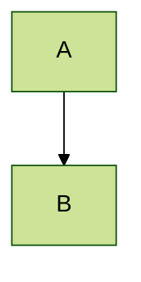
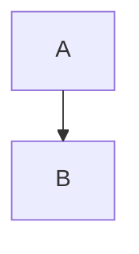
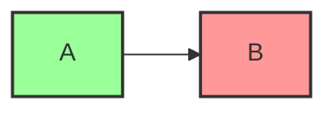
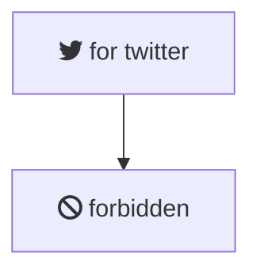

# Advanced Mermaid Features

This guide covers theming, styling, and configuration to make your diagrams look professional.

## Theming
You can set a theme using frontmatter configuration at the very top of your Mermaid code block.

### Supported Themes
- `default`: The standard theme.
- `forest`: Shades of green.
- `dark`: Dark mode colors.
- `neutral`: Grayscale/professional look.
- `base`: A base theme for custom styling.

## Layout Engines
For complex diagrams, you can switch layout engines.

## Styling Classes
Define CSS classes and apply them to multiple nodes.

## Interactive Elements (Click events)
*Note: Interactive elements only work in environments that support JavaScript execution for Mermaid.*

## Icons and Images
You can use FontAwesome icons if the environment supports them.

