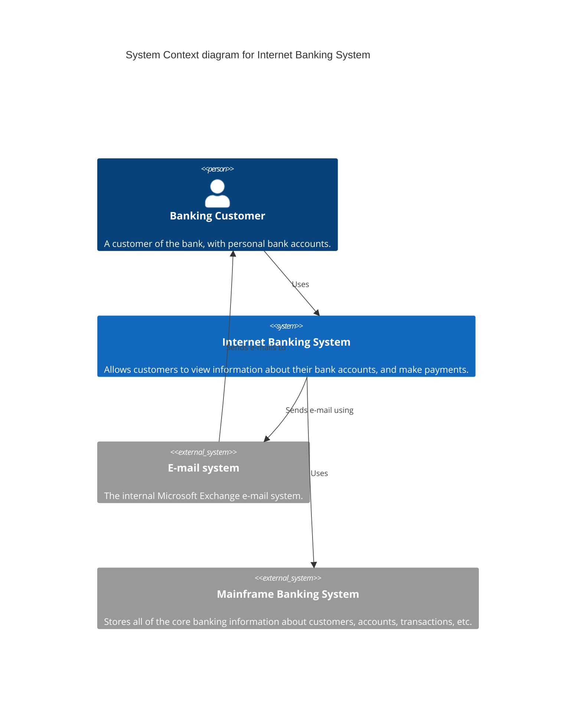
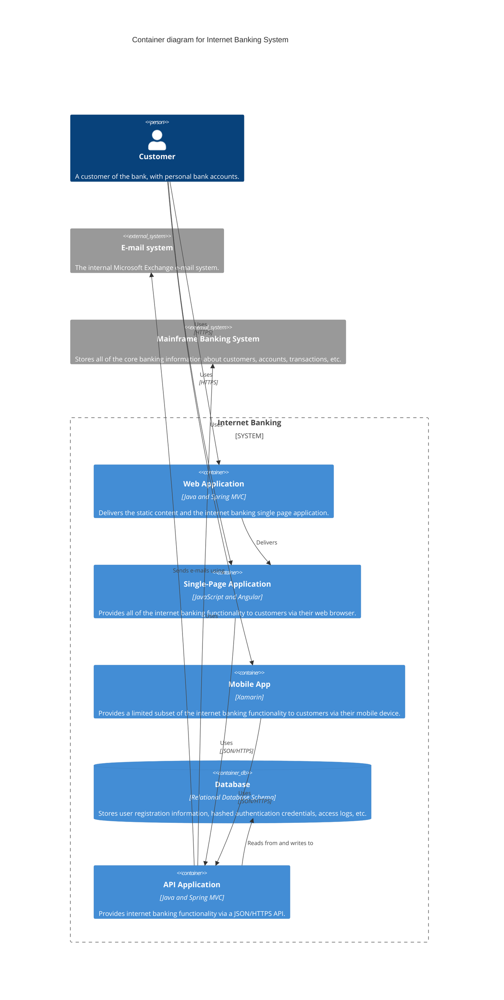
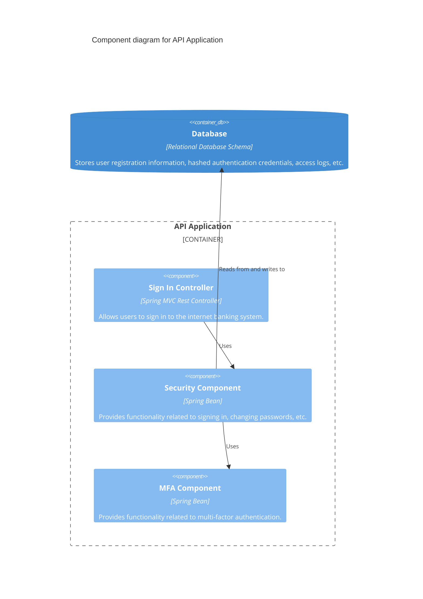

# C4 Model Diagrams

The C4 model is a lean graphical notation technique for modelling the architecture of software systems.

## 1. System Context Diagram
Shows the system in scope and its relationship with users and other systems.

## 2. Container Diagram
Zooms into the system in scope, showing the high-level technical building blocks.

## 3. Component Diagram
Zooms into an individual container to show the components inside it.

## Key Elements
- `Person(alias, label, [descr], [sprite], [tags])`
- `System(alias, label, [descr], [sprite], [tags])`
- `System_Ext(alias, label, [descr], [sprite], [tags])`
- `Container(alias, label, [techn], [descr], [sprite], [tags])`
- `ContainerDb(alias, label, [techn], [descr], [sprite], [tags])`
- `Component(alias, label, [techn], [descr], [sprite], [tags])`
- `Rel(from, to, label, [techn], [descr], [sprite], [tags])`
- `System_Boundary(alias, label)`
- `Container_Boundary(alias, label)`
