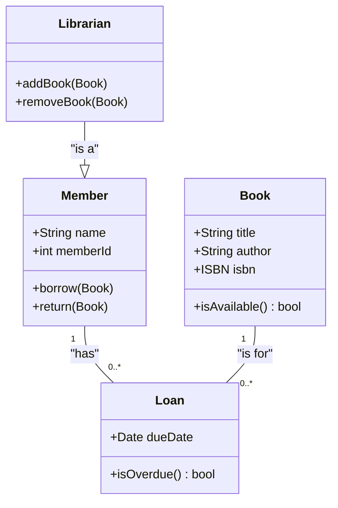

# Class Diagrams

Class diagrams are used for object-oriented design and domain modeling.

## Syntax Overview

- **Declaration**: `classDiagram`.
- **Classes**: `class ClassName { +type attribute\n+method() }`.
- **Visibility**:
    - `+`: Public.
    - `-`: Private.
    - `#`: Protected.
    - `~`: Package/Internal.
- **Relationships**:
    - `<--`: Inheritance.
    - `*--`: Composition.
    - `o--`: Aggregation.
    - `-->`: Association.
    - `..>`: Dependency.
    - `..|>`: Realization/Interface implementation.

## Example: Library System

## Key Elements
- **Classes**: Blocks with name, attributes, and methods.
- **Interfaces**: Use `<<interface>>` stereotype.
- **Abstract Classes**: Use `<<abstract>>` stereotype.
- **Annotations**: Use `<<annotation>>`.
