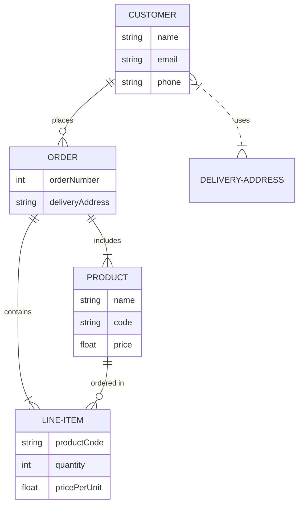

# Entity Relationship Diagrams (ERD)

ERDs are used to represent database schemas and data relationships.

## Syntax Overview

- **Declaration**: `erDiagram`.
- **Entities**: `ENTITY_NAME { type field_name "description" }`.
- **Relationships**: `ENTITY_A relationship ENTITY_B : "label"`.
- **Cardinality**:
    - `|o`: Zero or one.
    - `||`: Exactly one.
    - `}o`: Zero or many.
    - `}|`: One or many.

## Example: E-commerce Schema

## Key Elements
- **Entities**: Represented by rectangles.
- **Attributes**: Listed inside the entity block.
- **Relationships**: Defined by lines between entities with cardinality markers.
- **Labels**: Optional text describing the relationship.
