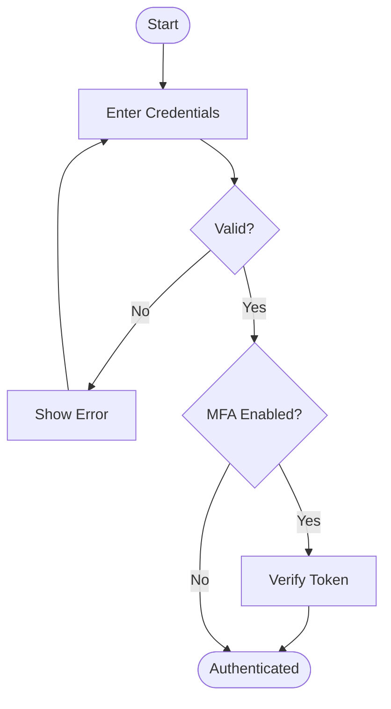
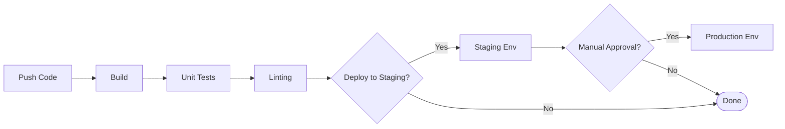
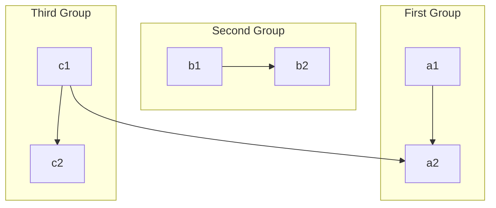
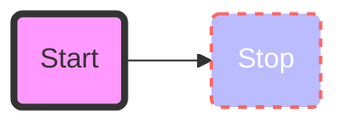

# Flowcharts

Flowcharts are used to represent processes, algorithms, and workflows.

## Syntax Overview

- **Direction**: `flowchart TD` (Top-Down), `flowchart LR` (Left-Right), `flowchart BT` (Bottom-Top), `flowchart RL` (Right-Left).
- **Nodes**:
    - `id[Rectangle]`: Standard process.
    - `id([Stadium])`: Start/End.
    - `id[[Subroutine]]`: Predefined process.
    - `id[(Cylinder)]`: Database.
    - `id{Rhombus}`: Decision.
    - `id{{Hexagon}}`: Preparation.
    - `id[/Parallelogram/]`: Input/Output.
- **Connections**:
    - `A --> B`: Arrow.
    - `A --- B`: Line.
    - `A -- Text --> B`: Arrow with text.
    - `A -.-> B`: Dotted arrow.
    - `A ==> B`: Thick arrow.
    - `A --o B`: Circle end.
    - `A --x B`: Cross end.

## Examples

### User Authentication Flow

### CI/CD Pipeline

## Advanced Features

### Subgraphs

### Styling Nodes

