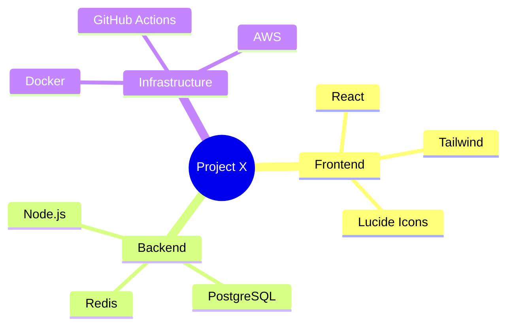
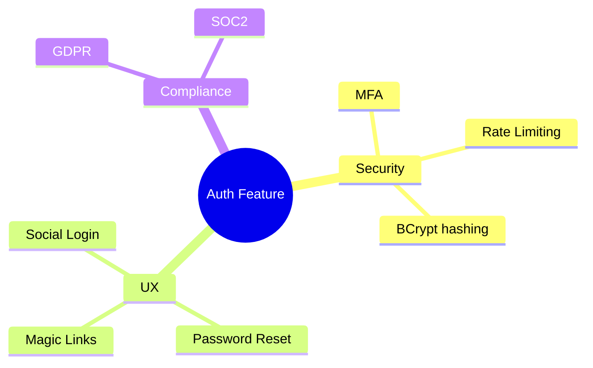

# Mindmaps

Mindmaps are used for brainstorming, hierarchical information mapping, and organizing thoughts during research or ADR phases.

## Syntax Overview

- **Root:** `mindmap` followed by the root node on a new line.
- **Hierarchy:** Indentation levels define the tree structure.
- **Shapes:**
    - `node`: Default
    - `((node))`: Circle
    - `)node)`: Rounded
    - `[node]`: Square
    - `{{node}}`: Hexagon

## Examples

### Project Brainstorming

### Feature Considerations

## Best Practices
- **Concise Nodes:** Keep node text short; use descriptions in the main document if more detail is needed.
- **Balanced Tree:** Try to balance branches for better readability.
- **Colors & Shapes:** Use different shapes to distinguish between "Categories" and "Leaves".
