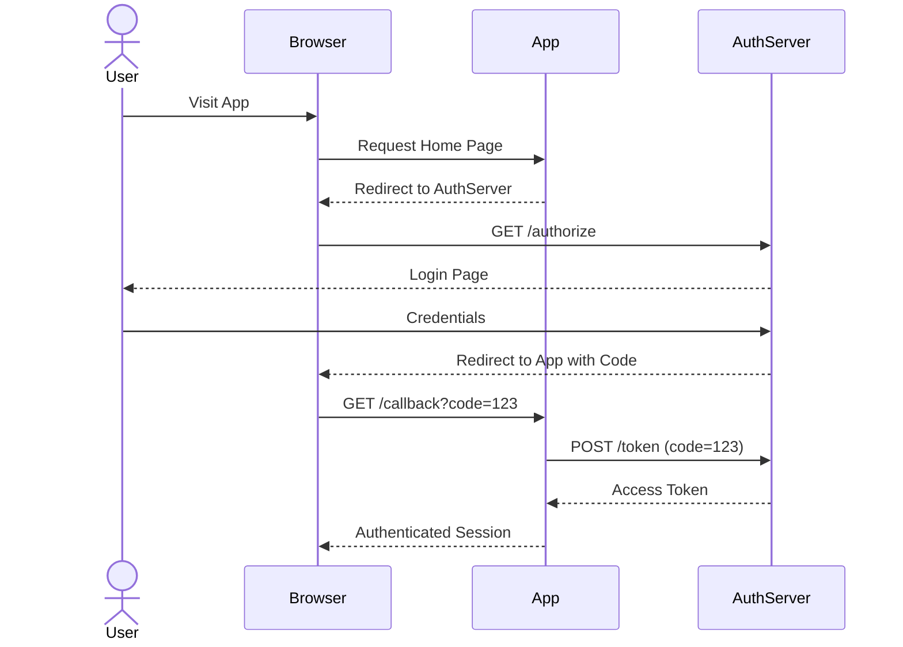
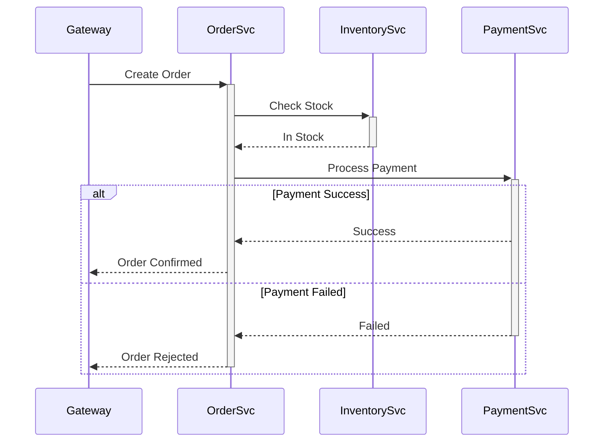
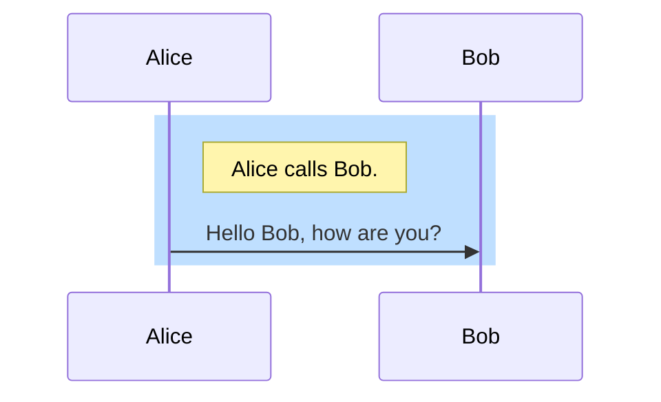

# Sequence Diagrams

Sequence diagrams are used to represent the interactions between multiple actors or systems over time.

## Syntax Overview

- **Declaration**: `sequenceDiagram`.
- **Participants**:
    - `participant Alice`: Standard participant.
    - `actor Bob`: Actor icon.
- **Messages**:
    - `A -> B`: Solid line without arrow.
    - `A ->> B`: Solid line with arrowhead.
    - `A -->> B`: Dashed line with arrowhead.
    - `A -x B`: Solid line with cross.
    - `A --x B`: Dashed line with cross.
- **Activations**:
    - `activate Alice` / `deactivate Alice`.
    - `A ->>+ B`: Arrow with activation of B.
    - `A -->>- B`: Arrow with deactivation of B.
- **Notes**:
    - `Note right of Alice: Text`.
    - `Note left of Bob: Text`.
    - `Note over Alice, Bob: Text`.
- **Loops and Logic**:
    - `loop Description ... end`.
    - `alt Case A ... else Case B ... end`.
    - `opt Optional Case ... end`.
    - `parallel Parallel Action ... end`.

## Examples

### OAuth2 Authorization Code Flow


### Microservice Interaction


## Advanced Features

### Autonumbering
```mermaid
sequenceDiagram
    autonumber
    Alice->>Bob: Hello Bob, how are you?
    loop Healthcheck
        Bob->>Alice: Better now; thanks for asking!
    end
```

### Styling

