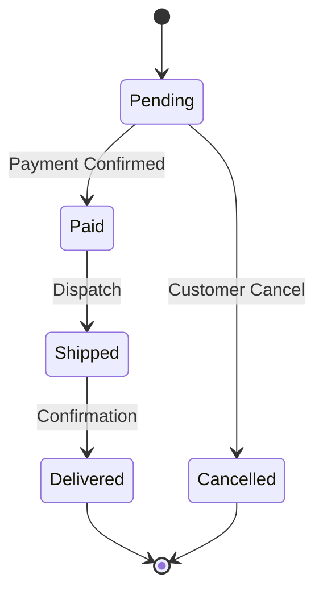
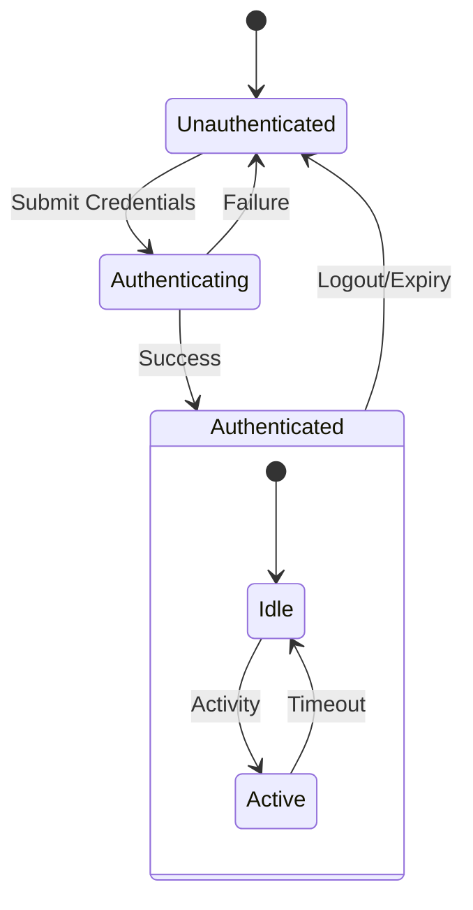

# State Diagrams

State diagrams are used to visualize the lifecycle of an object or the behavior of a system through a finite number of states.

## Syntax Overview

- **Start/End:** `[*] --> State1`, `State2 --> [*]`
- **States:** `state StateName`
- **Transitions:** `State1 --> State2 : event`
- **Composite States:** Use `state Parent { ... }` to nest states.
- **Choice:** `state choice_node <<choice>>`
- **Notes:** `note right of State1 : text`

## Examples

### Order Lifecycle

### Authentication Session

## Best Practices
- **Explicit Transitions:** Always label the event or condition that triggers a state change.
- **V2 Standard:** Always use `stateDiagram-v2` for the most modern rendering.
- **Keep it Focused:** One state diagram per entity; do not mix multiple independent objects.
