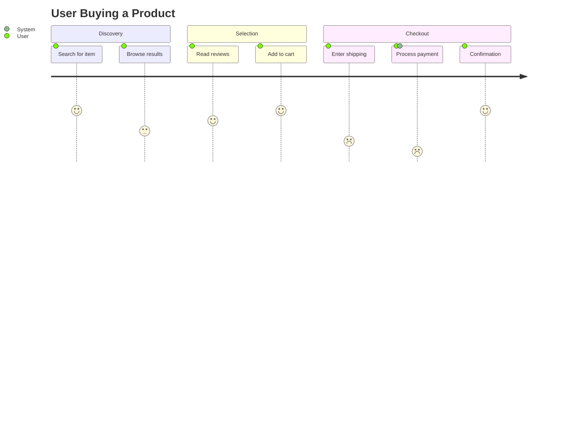
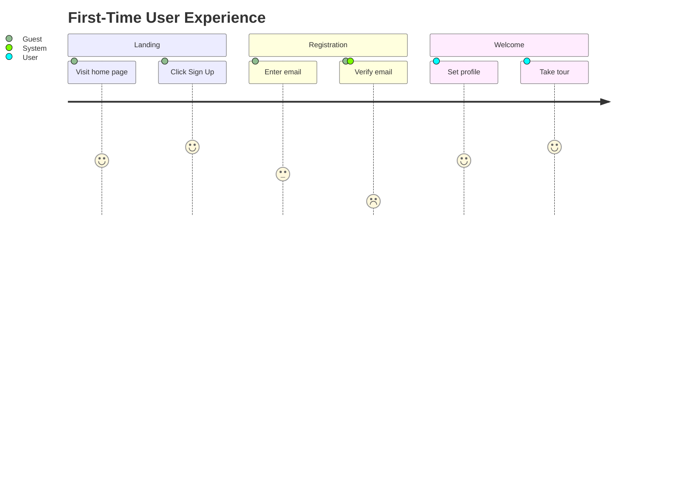

# User Journey Diagrams

User Journey diagrams describe the steps a user takes to complete a task, capturing their emotional state and the friction points along the way.

## Syntax Overview

- **Title:** `journey` followed by `title: Name`
- **Sections:** `section Section Name`
- **Tasks:** `Task Name: score: Actor1, Actor2`
    - Score is 0-5 (0 is lowest/most friction).

## Examples

### Product Checkout

### Onboarding Flow

## Best Practices
- **Actor Clarity:** Clearly define who is performing the task (User vs. System).
- **Friction Identification:** Use low scores (1 or 2) to highlight where the implementation needs the most focus.
- **Goal Oriented:** Every journey should have a clear start and end goal.
