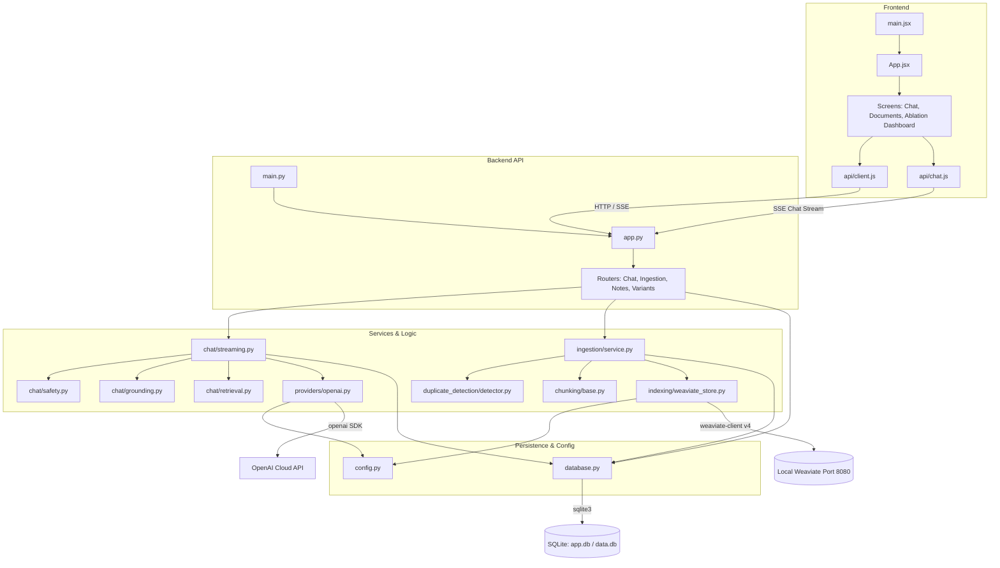

# Dependency Graph

Below is the high-level dependency structure mapping the relationship between components in the `chatbot-with-data` application.

## Component Dependency Relationships

```mermaid
graph TD
    %% Frontend Components
    subgraph Frontend
        main[main.jsx] --> App[App.jsx]
        App --> Screens[Screens: Chat, Documents, Ablation Dashboard]
        Screens --> ApiClient[api/client.js]
        Screens --> ApiChat[api/chat.js]
    end

    %% Backend Entrypoint & Routers
    subgraph Backend API
        main_py[main.py] --> app_py[app.py]
        app_py --> Routers[Routers: Chat, Ingestion, Notes, Variants]
    end

    %% Backend Services
    subgraph Services & Logic
        Routers --> StreamOrch[chat/streaming.py]
        Routers --> IngestServ[ingestion/service.py]
        
        StreamOrch --> Safety[chat/safety.py]
        StreamOrch --> Grounding[chat/grounding.py]
        StreamOrch --> Retrieval[chat/retrieval.py]
        StreamOrch --> OpenAI[providers/openai.py]

        IngestServ --> DupDetect[duplicate_detection/detector.py]
        IngestServ --> Chunking[chunking/base.py]
        IngestServ --> Weaviate[indexing/weaviate_store.py]
    end

    %% Shared Utilities & Storage
    subgraph Persistence & Config
        Config[config.py]
        DB[database.py]
        
        Weaviate --> Config
        OpenAI --> Config
        
        Routers --> DB
        StreamOrch --> DB
        IngestServ --> DB
    end

    %% External
    ApiClient -->|HTTP / SSE| app_py
    ApiChat -->|SSE Chat Stream| app_py
    Weaviate -->|weaviate-client v4| WeaviateServer[(Local Weaviate Port 8080)]
    DB -->|sqlite3| SQLiteFile[(SQLite: app.db / data.db)]
    OpenAI -->|openai SDK| OpenAIAPI[OpenAI Cloud API]
```
