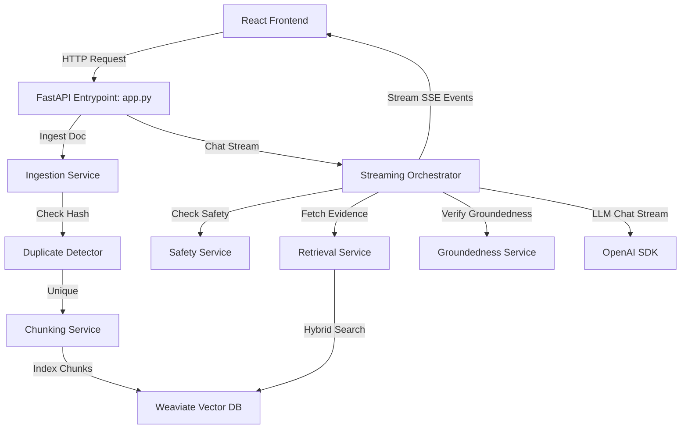

# Architecture

> Ownership: `Adopter-owned`

Living architecture doc for the installed CoreZero surface.

## System Snapshot

- Repository type: Adopter-facing harness package
- Primary runtime(s): Markdown, Bash, optional Python 3 for validation helpers
- Main entrypoints: `AGENTS.md`, `MASTER_INDEX.md`, `scripts/install.sh`, `skills/*/SKILL.md`
- Deployment shape: Installed workflow layer inside a downstream repository
- Confidence: High

## Top-Level Components

| Component | Responsibility | Key Paths | Notes |
| - | - | - | - |
| Router and policy entrypoints | Load-order and operating defaults | `AGENTS.md`, `core-zero/memories/repo/*` | Router stays thin; durable rules live in memory files |
| Installed docs | User-facing operating guidance | `core-zero/project/*`, `core-zero/rules/code-design.md`, `core-zero/generated/*` | Must match shipped files exactly |
| Skill contracts | Canonical workflow behavior | `skills/*/SKILL.md`, `skills/*/references/` | Behavioral source of truth |
| Maintenance scripts | Install helpers | `scripts/install.sh` | Used for install and upgrades |

## Runtime Boundaries

- Boundary: Installed docs vs source-repo maintainer docs
  Owner: `core-zero/` in the installed repo; `documents/` in the source repo
  Crossing rule: installed docs must never depend on nonexistent local maintainer files

- Boundary: Skill behavior vs explanation surfaces
  Owner: `skills/*/SKILL.md`
  Crossing rule: when a command or artifact contract changes, update `skills/`, `core-zero/`, `documents/`, and generated references together

- Boundary: Kit-managed vs adopter-owned files
  Owner: `manifest.json` in the source repo
  Crossing rule: overwrite only kit-managed files; preserve adopter-owned seeded content and artifacts. Posture detail (`overwrite` / `copyIfMissing` / `preserve`) is explained in `core-zero/memories/repo/project-knowledge-base.md` §1.

## Safe Change Guidance

- High-risk areas: `scripts/install.sh`, `core-zero/generated/*`, shipped path claims in `core-zero/project/*`, and `core-zero/rules/code-design.md`
- Required proof: installer dry-run and install smoke test

## Application Architecture

The repository contains a decoupled Single Page Application (SPA) frontend and a Python FastAPI backend.

### Top-Level Layout & Folder Structure

- `/backend`: Python FastAPI application logic, ingestion services, vector storage indexing, and pytest suite.
  - `/backend/app.py`: Application startup and router configuration.
  - `/backend/chat`: Chat streaming orchestrator, citations, retrieval, and grounding/safety services.
  - `/backend/chunking`: Smart text chunking mechanisms (adaptive, heading-aware, parent-child, semantic).
  - `/backend/indexing`: Indexing logic for Weaviate vector store and SQLite document registry.
  - `/backend/ingestion`: Document parsing, duplicate detection, and text understanding.
- `/frontend`: Vite-bundled React application.
  - `/frontend/src/main.jsx`: Application mount point.
  - `/frontend/src/App.jsx`: Screen routing and base layout.
  - `/frontend/src/api`: Native fetch HTTP client and SSE event streaming parser (`client.js` and `chat.js`).

### Backend Data Flow

## Architectural Decision Records (ADRs)

All architectural decisions for this project are documented individually to maintain context over time.
See the [ADR Master Index](adr/index.md) for a complete log of decisions.

