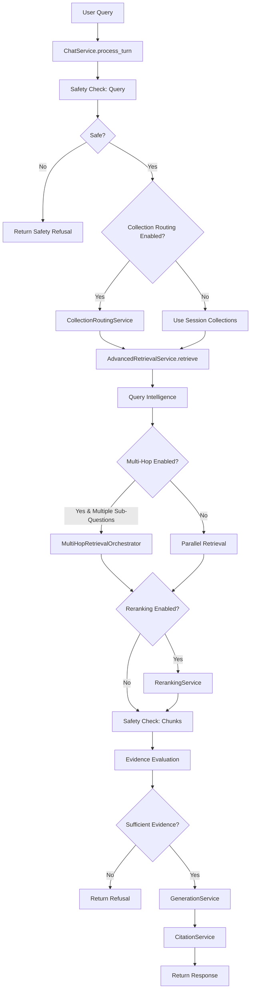
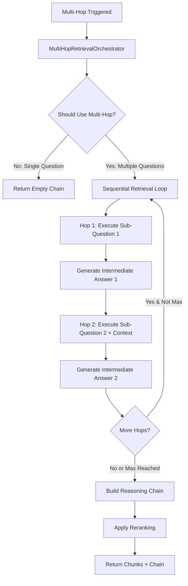
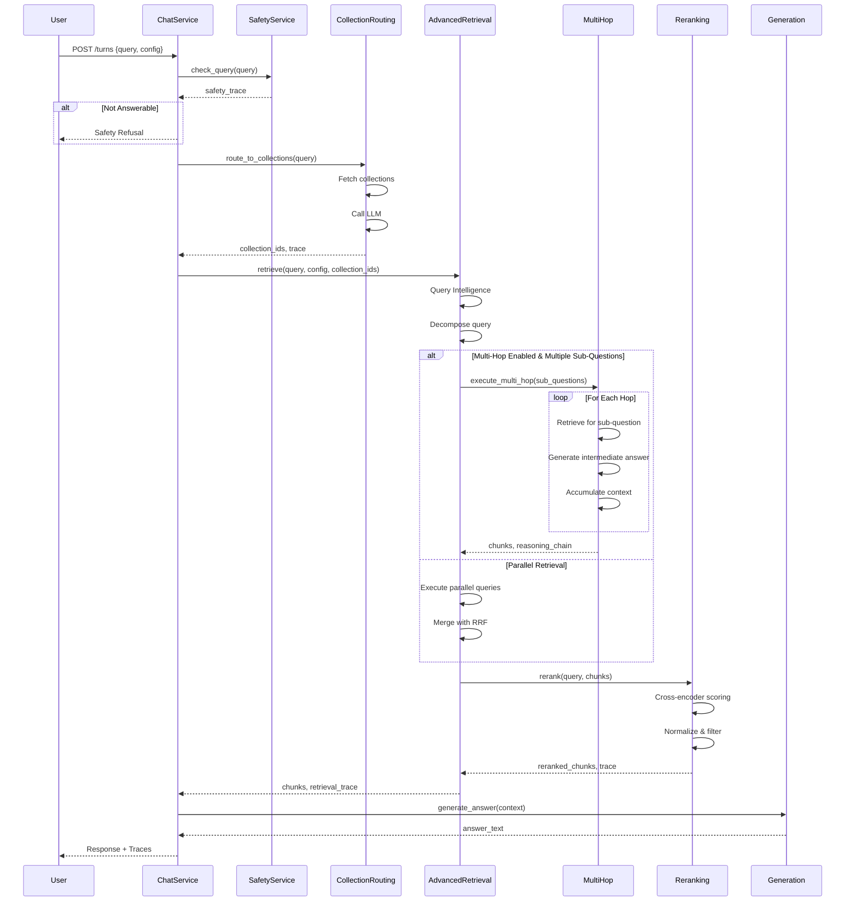

# Retrieval Flow Documentation

**Version:** 3.0  
**Last Updated:** 2026-05-20  
**Scope:** Complete System Retrieval Architecture

---

## Introduction

This document serves as a comprehensive guide to understanding **retrieval in RAG (Retrieval-Augmented Generation) systems**. Whether you're new to RAG or looking to understand production-grade retrieval architectures, this document covers:

- **Foundational Concepts** - How vector search, embeddings, and hybrid retrieval work
- **Query Intelligence** - LLM-powered query transformations for better retrieval
- **Multi-Strategy Retrieval** - Parallel execution and result merging techniques
- **Advanced Techniques** - Collection routing, reranking, and multi-hop reasoning
- **Production Considerations** - Performance, monitoring, error handling, and best practices

**Target Audience:**
- AI/ML engineers learning RAG systems
- Backend engineers implementing retrieval pipelines
- System architects designing RAG architectures
- Anyone wanting to understand how production RAG retrieval works

---

## Overview

This document describes the complete retrieval system architecture for the TechCorp RAG chatbot. The system orchestrates query safety checks, intelligent query transformations, multi-strategy retrieval, relevance reranking, and evidence evaluation to return the most relevant document chunks for grounding LLM responses.

### System Capabilities

The retrieval system includes:

1. **Safety & Classification** - Prompt injection detection and query type classification
2. **Collection Routing** - Intelligent routing to relevant document collections
3. **Query Intelligence** - LLM-powered query transformations (classification, expansion, rewriting, decomposition, HyDE, synonyms)
4. **Multi-Strategy Retrieval** - Parallel retrieval with Reciprocal Rank Fusion (RRF) merging
5. **Multi-Hop Reasoning** - Sequential iterative retrieval for complex multi-step queries
6. **Relevance Reranking** - Cross-encoder model for improved chunk ranking
7. **Evidence Evaluation** - Grounding assessment and safety validation

---

## RAG Fundamentals

### What is RAG?

**RAG (Retrieval-Augmented Generation)** is a technique that combines information retrieval with language model generation:

1. **Retrieval Phase** - Find relevant documents/chunks from a knowledge base
2. **Augmentation Phase** - Add retrieved context to the LLM prompt
3. **Generation Phase** - LLM generates response grounded in retrieved context

**Why RAG?**
- LLMs have fixed knowledge cutoff (outdated information)
- LLMs have limited context windows (can't fit all knowledge)
- LLMs hallucinate when lacking relevant context
- RAG provides current, domain-specific, verifiable information

### Key Concepts

**Embeddings**
- Dense vector representation of text (e.g., 768-dimensional vector)
- Captures semantic meaning: similar texts have similar embeddings
- Generated by embedding models (OpenAI, Cohere, open-source models)
- Example: "authentication system" and "identity verification" have similar embeddings

**Vector Database**
- Stores embeddings and enables fast similarity search
- Used in this system: Weaviate
- Supports both semantic (vector) and keyword (BM25) search
- Enables retrieval of top-k most similar documents

**Similarity Search**
- Find documents most similar to query using embeddings
- Measured by cosine similarity, L2 distance, or dot product
- Returns ranked list of documents by relevance score

**Semantic vs Keyword Search**
- **Semantic:** Understands meaning ("What is authentication?" matches "How does identity verification work?")
- **Keyword:** Exact term matching ("authentication" matches "authentication" but not "identity verification")
- **Hybrid:** Combines both for better recall and precision

**Chunking**
- Breaking large documents into smaller pieces (chunks)
- Enables more precise retrieval (retrieve relevant section, not entire document)
- Trade-off: smaller chunks = more precise but lose context; larger chunks = more context but less precise

**Reranking**
- Re-score retrieved chunks using more sophisticated models
- Initial retrieval: fast but less accurate (bi-encoder)
- Reranking: slower but more accurate (cross-encoder)
- Improves quality of final results

**Multi-Hop Reasoning**
- Complex queries requiring multiple retrieval steps
- Example: "What did the CEO say about the product mentioned in Q3 earnings?"
  - Hop 1: Find product mentioned in Q3 earnings
  - Hop 2: Find CEO statements about that product
- Enables answering questions that require combining information from multiple sources

---

## How to Read This Document

**For Beginners (New to RAG):**
1. Start with **RAG Fundamentals** (above) - understand core concepts
2. Read **Baseline Retrieval Flow** - see how basic vector search works
3. Review **High-Level Architecture** - understand the complete system flow
4. Explore **Query Intelligence Transformations** - learn how queries are improved
5. Study **Collection Routing**, **Relevance Reranking**, **Multi-Hop Reasoning** - understand advanced techniques
6. Review **Configuration Reference** and **Best Practices** - learn when to use each feature

**For Experienced Engineers:**
1. **High-Level Architecture** - get system overview
2. **Core Components** - understand service responsibilities
3. **Complete Flow Diagram** - see end-to-end sequence
4. **Configuration Reference** - understand all options
5. **Performance Characteristics** - latency and throughput expectations
6. **Monitoring & Observability** - production metrics

**For Troubleshooting:**
- Jump to **Troubleshooting Guide** for common issues
- Review **Error Handling & Fallbacks** for failure scenarios
- Check **Trace Schema Reference** for debugging with traces

---

## High-Level Architecture



---

## Core Components

### 1. ChatService
**Location:** `backend/chat/service.py`

**Responsibility:** Orchestrates the complete chat turn workflow.

**Key Methods:**
- `process_turn(session_id, query_text, advanced_config)` - Main entry point

**Flow:**
1. Load session from database
2. Safety check on query
3. Collection routing (if enabled)
4. Retrieve chunks via AdvancedRetrievalService
5. Safety check on chunks
6. Evaluate evidence sufficiency
7. Generate response
8. Extract citations
9. Persist turn to database

---

### 2. SafetyService
**Location:** `backend/chat/safety.py`

**Responsibility:** Detect unsafe queries and malicious chunks.

**Key Methods:**
- `check_query(query_text)` → SafetyTrace
- `check_chunks(chunks)` → List of chunks with safety_risk field

**Safety Checks:**
- Prompt injection detection
- Query classification (safe, unsafe, out_of_domain)
- Chunk content validation

---

### 3. CollectionRoutingService
**Location:** `backend/chat/collection_routing.py`

**Responsibility:** Automatically detect which collections are relevant to the query.

**Key Methods:**
- `route_to_collections(query, confidence_threshold, max_collections)` → (collection_ids, trace)

**Behavior:**
- Uses LLM to analyze query and match to collection descriptions
- Returns confidence score (0-1)
- Falls back to all collections if confidence < threshold

---

### 4. AdvancedRetrievalService
**Location:** `backend/chat/retrieval.py`

**Responsibility:** Orchestrates query intelligence, retrieval strategies, and advanced features.

**Key Methods:**
- `retrieve(query_text, config, collection_ids, k)` → (chunks, trace)

**Sub-Components:**
- `QueryIntelligenceService` - LLM-powered query transformations
- `RetrievalService` - Baseline vector search
- `RerankingService` - Cross-encoder reranking
- `CandidateMerger` - Reciprocal Rank Fusion (RRF) for merging results

---

### 5. MultiHopRetrievalOrchestrator
**Location:** `backend/chat/multi_hop.py`

**Responsibility:** Execute sequential iterative retrieval for complex multi-hop queries.

**Key Methods:**
- `execute_multi_hop(query, sub_questions, config, collection_ids)` → (chunks, reasoning_chain)

**Behavior:**
- Executes sub-questions sequentially
- Generates intermediate answers
- Accumulates context across hops
- Enforces timeout and max_hops limits

---

### 6. GenerationService
**Location:** `backend/chat/generation.py`

**Responsibility:** Generate final answer using LLM with retrieved context.

**Key Methods:**
- `generate(query, chunks, session_history)` → answer_text

---

### 7. CitationService
**Location:** `backend/chat/citations.py`

**Responsibility:** Extract citations from generated answer and map to source chunks.

**Key Methods:**
- `extract_citations(answer_text, chunks)` → List[CitationResponse]

---

## Baseline Retrieval Flow

This is the default retrieval path when no advanced features are enabled.

### Step 1: Query Embedding

```python
# RetrievalService.retrieve_relevant_chunks()
query_embedding = embedding_provider.embed_query(query_text)
```

**Embedding Model:** Configured via `EMBEDDING_PROVIDER` (e.g., OpenAI, Cohere, local models)

---

### Step 2: Vector Search

```python
# Query vector store with hybrid search
raw_results = vector_store.query_hybrid(
    query_text=query_text,
    query_embedding=query_embedding,
    alpha=alpha,  # 0.0=keyword, 1.0=semantic, 0.5=hybrid
    k=k,  # Number of results
    collection_ids=collection_ids
)
```

**Search Modes:**
- `keyword` (alpha=0.0): BM25 keyword search
- `semantic` (alpha=1.0): Vector similarity search
- `hybrid` (alpha=0.5): Weighted combination of both

**Vector Store:** Weaviate (configured in `backend/indexing/weaviate_store.py`)

---

### Step 3: Result Formatting

```python
# Enrich results with chunk metadata
formatted_results = []
for chunk_id, similarity, metadata in raw_results:
    chunk_data = chunk_repo.get_chunk(chunk_id)
    result = {
        "chunk_id": chunk_id,
        "similarity_score": similarity,
        "text": chunk_data["text"],
        "document_id": chunk_data["document_id"],
        "collection_id": chunk_data["collection_id"],
        ...metadata
    }
    formatted_results.append(result)
```

**Output:** List of chunks with similarity scores, sorted by relevance.

---

## Query Intelligence Transformations

Query intelligence uses LLM to transform the user query before retrieval. All transformations are **optional** and controlled by `AdvancedRetrievalConfig`.

### 1. Query Classification

**Purpose:** Classify query type to route to appropriate strategy.

**Prompt:** `QUERY_CLASSIFICATION_PROMPT`

**Output:** One of:
- `simple` - Direct factual question
- `multi_hop` - Requires multiple retrieval steps
- `out_of_domain` - Not answerable from knowledge base
- `conversational` - Chitchat or greeting

**Usage:**
```python
if config.enable_intelligence:
    classification = query_intelligence_service.classify_query(query_text)
    trace.classification = classification
```

---

### 2. Query Rewriting

**Purpose:** Rephrase query for better retrieval (resolve pronouns, expand abbreviations).

**Prompt:** `QUERY_REWRITING_PROMPT`

**Example:**
- Input: "What about it?"
- Output: "What about the authentication system?"

**Usage:**
```python
if config.enable_rewriting:
    rewritten = query_intelligence_service.rewrite_query(query_text)
    trace.transformations.rewritten_query = rewritten
```

---

### 3. Query Expansion

**Purpose:** Generate alternative phrasings of the query.

**Prompt:** `QUERY_EXPANSION_PROMPT`

**Example:**
- Input: "How does authentication work?"
- Output: ["How does the authentication system function?", "What is the authentication process?", "Explain authentication mechanism"]

**Usage:**
```python
if config.enable_expansion:
    expanded = query_intelligence_service.expand_query(query_text, count=3)
    trace.transformations.expanded_queries = expanded
```

---

### 4. Query Decomposition

**Purpose:** Break complex query into simpler sub-questions.

**Prompt:** `QUERY_DECOMPOSITION_PROMPT`

**Example:**
- Input: "What did the CEO say about the product mentioned in Q3 earnings?"
- Output: ["What product was mentioned in Q3 earnings?", "What did the CEO say about that product?"]

**Usage:**
```python
if config.enable_decomposition:
    sub_questions = query_intelligence_service.decompose_query(query_text)
    trace.transformations.sub_questions = sub_questions
```

---

### 5. HyDE (Hypothetical Document Embeddings)

**Purpose:** Generate a hypothetical answer, then search for documents similar to that answer.

**Prompt:** `HYDE_PROMPT`

**Example:**
- Input: "How does authentication work?"
- Output: "Authentication works by verifying user identity through multiple factors including passwords, biometrics, and behavioral analysis..."

**Usage:**
```python
if config.enable_hyde:
    hyde_doc = query_intelligence_service.generate_hyde(query_text)
    trace.transformations.hyde_doc = hyde_doc
```

---

### 6. Synonym Expansion

**Purpose:** Replace key terms with synonyms to improve recall.

**Prompt:** `SYNONYM_EXPANSION_PROMPT`

**Example:**
- Input: "authentication system"
- Output: {"authentication": "verification identity-check", "system": "platform solution"}

**Usage:**
```python
if config.enable_synonym_expansion:
    synonyms = query_intelligence_service.expand_synonyms(query_text)
    trace.transformations.synonym_expansions = synonyms
```

---

## Parallel Retrieval Path

When multi-hop is disabled or only one sub-question exists, the system uses parallel retrieval.

### Step 1: Build Query Variations

```python
queries_to_run = [query_text]

# Add rewritten query
if config.enable_rewriting and rewritten_query:
    queries_to_run.append(rewritten_query)

# Add expanded queries
if config.enable_expansion and expanded_queries:
    queries_to_run.extend(expanded_queries)

# Add sub-questions
if config.enable_decomposition and sub_questions:
    queries_to_run.extend(sub_questions)

# Add HyDE document
if config.enable_hyde and hyde_doc:
    queries_to_run.append(hyde_doc)

# Deduplicate
unique_queries = list(dict.fromkeys(queries_to_run))
```

---

### Step 2: Execute Parallel Retrieval

```python
all_results = []
for query in unique_queries:
    # Apply synonym expansion to query
    search_query = query
    if config.enable_synonym_expansion:
        for old, new in synonym_expansions.items():
            search_query = search_query.replace(old, new)
    
    # Retrieve chunks
    chunks = baseline_retrieval_service.retrieve_relevant_chunks(
        query_text=search_query,
        collection_ids=collection_ids,
        k=k,
        alpha=effective_alpha
    )
    all_results.append(chunks)
```

---

### Step 3: Merge Results with RRF

**Reciprocal Rank Fusion (RRF):** Combines multiple ranked lists into a single ranking.

**Formula:**
```
RRF_score(chunk) = Σ (1 / (k + rank_i))
```
Where:
- `k` = 60 (constant)
- `rank_i` = rank of chunk in result list i

**Implementation:**
```python
class CandidateMerger:
    def merge(self, result_lists, top_k):
        scores = defaultdict(float)
        for result_list in result_lists:
            for rank, chunk in enumerate(result_list):
                chunk_id = chunk["chunk_id"]
                scores[chunk_id] += 1.0 / (60 + rank)
        
        # Sort by RRF score
        sorted_chunks = sorted(scores.items(), key=lambda x: x[1], reverse=True)
        return sorted_chunks[:top_k]
```

---

## Collection Routing

**Purpose:** Automatically route queries to relevant collections based on query content and collection descriptions.

**Trigger Condition:**
```python
if config.enable_collection_routing and not session.collection_ids:
    # Auto-detect collections
```

### Flow

```
CollectionRoutingService.route_to_collections(query, threshold, max_collections)
  ├─ Fetch all collections from database (id, name, description)
  ├─ Build routing prompt with collection metadata
  ├─ Call LLM for routing decision
  ├─ Parse JSON response: {collection_ids, confidence, reasoning}
  ├─ Apply confidence threshold (default: 0.7)
  │   ├─ If confidence >= threshold: Use selected collections
  │   └─ If confidence < threshold: Fallback to all collections (empty list)
  └─ Return (collection_ids, CollectionRoutingTrace)
```

### Trace Fields

- `collection_routing.routing_decision`: Selected collection IDs
- `collection_routing.confidence`: 0.0-1.0 score
- `collection_routing.reasoning`: LLM explanation
- `collection_routing.fallback_reason`: If fallback triggered
- `collection_routing.latency_ms`: Routing time

### Performance

- Target: <500ms
- Typical: 200-400ms (LLM call + parsing)

---

## Relevance Reranking

**Purpose:** Improve relevance ranking using cross-encoder model after initial retrieval.

**Trigger Condition:**
```python
if config.enable_reranking and chunks:
    # Apply reranking
```

### Flow

```
RerankingService.rerank(query_text, chunks, top_k)
  ├─ Load cross-encoder model (ms-marco-MiniLM-L-6-v2)
  ├─ Score each (query, chunk) pair
  ├─ Re-sort chunks by cross-encoder score
  ├─ Return top_k chunks
  └─ Build RerankingTrace
```

### Cross-Encoder Model

**Model:** `cross-encoder/ms-marco-MiniLM-L-6-v2`

**How it works:**
- Unlike bi-encoders (separate query/doc embeddings), cross-encoders process query+document together
- More accurate but slower (cannot pre-compute)
- Applied after initial retrieval to re-score candidates

### Trace Fields

- `reranking.model`: Model identifier
- `reranking.pre_order_ids`: Chunk IDs before reranking
- `reranking.post_order_ids`: Chunk IDs after reranking
- `reranking.latency_ms`: Reranking time

### Performance

- Target: <200ms for 10 chunks
- Typical: 100-150ms

### Fallback

If reranking fails (model load error, timeout), system falls back to similarity-based sorting.

---

## Multi-Hop Reasoning

**Purpose:** Execute sequential iterative retrieval for complex queries requiring multiple steps.

**Trigger Condition:**
```python
if config.enable_multi_hop and sub_questions and len(sub_questions) > 1:
    # Use multi-hop path
```

### Decision Point

After query decomposition, the system decides:
- **Single sub-question** → Use parallel retrieval (no multi-hop needed)
- **Multiple sub-questions** → Use multi-hop orchestrator

### Flow Diagram



### Sequential Retrieval Loop

```
_execute_sequential_retrieval(sub_questions, config, collection_ids, max_hops, timeout_ms)
  ├─ Initialize: context = "", all_chunks = [], reasoning_steps = []
  ├─ Limit questions to max_hops (default: 3)
  └─ For each sub_question (sequential):
      ├─ Check timeout (default: 30s)
      │   └─ If exceeded: Record failure, break
      ├─ Contextualize question with previous answers
      ├─ Execute retrieval for this sub-question
      ├─ Generate intermediate answer from chunks
      │   ├─ Build context from top 5 chunks
      │   ├─ Call LLM: "Answer this question concisely (1-3 sentences)"
      │   └─ Append to accumulated context
      ├─ Record ReasoningStep:
      │   ├─ hop_number
      │   ├─ sub_question
      │   ├─ retrieved_chunk_ids
      │   ├─ intermediate_answer
      │   ├─ latency_ms
      │   └─ failure (if any)
      └─ If failure: Break loop, trigger fallback
```

### Intermediate Answer Generation

```
_generate_intermediate_answer(sub_question, chunks)
  ├─ Extract content from top 5 chunks
  ├─ Build prompt:
  │   "Based on the following information, provide a concise answer (1-3 sentences)
  │    Question: {sub_question}
  │    Information: {chunk_texts}"
  ├─ Call LLM
  └─ Return answer (or fallback message on error)
```

### Failure Handling

```
_handle_step_failure(query, remaining_sub_questions, config, collection_ids)
  ├─ Combine original query + remaining sub-questions
  ├─ Execute fallback retrieval
  └─ Return chunks (or empty on failure)
```

**Fallback Strategy:**
- Original query: "What did the CEO say about the product mentioned in Q3 earnings?"
- Remaining: ["What did the CEO say about [product]?"]
- Fallback query: Original + "Additional context: " + remaining

### Reasoning Chain Assembly

```
ReasoningChainTrace:
  ├─ hops: List[ReasoningStep]
  ├─ total_hops: int
  ├─ fallback_triggered: bool
  ├─ fallback_reason: Optional[str]
  └─ total_latency_ms: int
```

---

## Parallel Retrieval Path (Existing)

**When Used:**
- Multi-hop disabled OR
- Single sub-question OR
- Multi-hop execution failed (fallback)

### Flow

```
Parallel Retrieval:
  ├─ Build unique_queries from transformations:
  │   ├─ Original query
  │   ├─ Rewritten query
  │   ├─ Expanded queries
  │   ├─ Sub-questions (treated as parallel)
  │   ├─ HyDE document
  │   └─ Synonym-expanded queries
  ├─ For each query (parallel):
  │   ├─ Apply synonym expansions
  │   ├─ Execute baseline retrieval (vector search)
  │   └─ Record RetrievalRunTrace
  ├─ Merge results with RRF (Reciprocal Rank Fusion)
  │   └─ k=60 (default)
  └─ Return merged chunks
```

**RRF Formula:**
```
score(chunk) = Σ(1 / (k + rank_in_query_i))
```

---

## Reranking Phase

**Trigger:**
```python
if config.enable_reranking and chunks:
    chunks, rerank_trace = reranking_service.rerank(query, chunks, top_k)
```

### Reranking Flow

```
RealRerankingService.rerank(query, candidates, top_k, threshold)
  ├─ Lazy load cross-encoder model (if not loaded)
  │   └─ Model: cross-encoder/ms-marco-MiniLM-L-6-v2
  ├─ Limit to top N candidates (default: 50)
  ├─ For each candidate:
  │   ├─ Build input pair: (query, chunk_content)
  │   └─ Compute relevance score via model.predict()
  ├─ Normalize scores to [0, 1] range (min-max scaling)
  ├─ Filter chunks below threshold (default: 0.3)
  ├─ Sort by normalized score (descending)
  ├─ Take top_k chunks
  └─ Build RerankingTrace:
      ├─ model: "cross-encoder/ms-marco-MiniLM-L-6-v2"
      ├─ pre_order_ids: Original order
      ├─ post_order_ids: Reranked order
      └─ latency_ms: Reranking time
```

**Fallback on Error:**
- If model loading fails → Sort by similarity_score
- If inference fails → Sort by similarity_score
- Model name in trace: "{model_name}-fallback"

**Performance:**
- Target: <200ms for 50 candidates
- Typical: 100-150ms

---

## Complete Flow Diagram



---

## Configuration Reference

### AdvancedRetrievalConfig

```python
class AdvancedRetrievalConfig(BaseModel):
    # Query Intelligence
    enable_intelligence: bool = True
    enable_rewriting: bool = True
    enable_expansion: bool = True
    expansion_count: int = 3
    enable_decomposition: bool = True
    enable_hyde: bool = True
    enable_synonym_expansion: bool = True
    enable_dynamic_routing: bool = True

    # Reranking
    enable_reranking: bool = True
    reranker_model: Optional[str] = None  # Default: ms-marco-MiniLM-L-6-v2
    reranker_top_k: Optional[int] = None  # Default: 50
    rerank_threshold: float = 0.3

    # Collection Routing
    enable_collection_routing: bool = False
    collection_routing_threshold: float = 0.7
    collection_routing_max_collections: int = 3

    # Multi-Hop Reasoning
    enable_multi_hop: bool = False
    max_hops: int = 3
    multi_hop_timeout_ms: int = 30000

    # Other
    enable_parent_child: bool = True
    retrieval_mode: Optional[str] = None  # semantic/keyword/hybrid
    hybrid_weight: Optional[float] = None
```

---

## Performance Characteristics

### Latency Breakdown

**Baseline (No Features):**
```
Query Intelligence:     100-200ms
Parallel Retrieval:     500-1000ms
Context Assembly:       50-100ms
Generation:            1000-2000ms
─────────────────────────────────
Total:                 1650-3300ms
```

**With Reranking:**
```
Baseline:              1650-3300ms
Reranking:             +100-200ms
─────────────────────────────────
Total:                 1750-3500ms
```

**With Collection Routing:**
```
Baseline:              1650-3300ms
Collection Routing:    +200-500ms
─────────────────────────────────
Total:                 1850-3800ms
```

**With Multi-Hop (2 hops):**
```
Query Intelligence:     100-200ms
Hop 1 Retrieval:       500-1000ms
Intermediate Answer:   500-1000ms
Hop 2 Retrieval:       500-1000ms
Intermediate Answer:   500-1000ms
Reranking:             100-200ms
Context Assembly:      50-100ms
Generation:            1000-2000ms
─────────────────────────────────
Total:                 3250-6500ms (2-3x baseline)
```

**All Features Combined:**
```
Collection Routing:    200-500ms
Multi-Hop (2 hops):    3000-5000ms
Reranking:             100-200ms
Generation:            1000-2000ms
─────────────────────────────────
Total:                 4300-7700ms
```

### Throughput

**Concurrent Requests:**
- Baseline: 100 req/s
- With Reranking: 80 req/s (model inference bottleneck)
- With Multi-Hop: 30 req/s (sequential execution)

**Scaling Considerations:**
- Reranking: GPU acceleration recommended for >50 req/s
- Multi-Hop: Consider async execution for independent hops
- Collection Routing: Cache routing decisions for similar queries

---

## Trace Schema Reference

### RetrievalTrace

```python
class RetrievalTrace(BaseModel):
    original_query: str
    classification: Optional[str]  # simple/multi_hop/etc
    transformations: RetrievalTransformations
    routing: RetrievalRouting
    retrieval_runs: List[RetrievalRunTrace]
    merged_candidates_count: int
    reranking: Optional[RerankingTrace]
    collection_routing: Optional[CollectionRoutingTrace]
    reasoning_chain: Optional[ReasoningChainTrace]
    parent_child_expansions_count: int
    execution_time_ms: Dict[str, int]
```

### ReasoningChainTrace

```python
class ReasoningChainTrace(BaseModel):
    hops: List[ReasoningStep]
    total_hops: int
    fallback_triggered: bool
    fallback_reason: Optional[str]
    total_latency_ms: int

class ReasoningStep(BaseModel):
    hop_number: int
    sub_question: str
    retrieved_chunk_ids: List[str]
    intermediate_answer: Optional[str]
    latency_ms: Optional[int]
    failure: Optional[str]
```

### CollectionRoutingTrace

```python
class CollectionRoutingTrace(BaseModel):
    routing_decision: List[str]  # Collection IDs
    confidence: Optional[float]  # 0.0-1.0
    reasoning: Optional[str]
    fallback_reason: Optional[str]
    latency_ms: Optional[int]
```

### RerankingTrace

```python
class RerankingTrace(BaseModel):
    model: str
    pre_order_ids: List[str]
    post_order_ids: List[str]
    latency_ms: Optional[int]
```

---

## Error Handling & Fallbacks

### Collection Routing Failures

**Scenario:** LLM call fails or returns invalid JSON

**Fallback:**
```python
try:
    collection_ids, trace = routing_service.route_to_collections(...)
except Exception as e:
    logger.error(f"Collection routing failed: {e}")
    collection_ids = []  # Fallback to all collections
    trace = CollectionRoutingTrace(
        routing_decision=[],
        confidence=0.0,
        fallback_reason=f"Routing error: {str(e)}"
    )
```

### Multi-Hop Failures

**Scenario:** Intermediate hop retrieves no chunks

**Fallback:**
```python
if not chunks or all chunks below threshold:
    # Record failure in ReasoningStep
    step.failure = "No relevant chunks retrieved"
    # Execute fallback retrieval
    fallback_chunks = _handle_step_failure(
        original_query,
        remaining_sub_questions,
        config,
        collection_ids
    )
    # Continue with fallback chunks
```

### Reranking Failures

**Scenario:** Cross-encoder model fails to load or inference error

**Fallback:**
```python
try:
    scores = self.model.predict(pairs)
except Exception as e:
    logger.error(f"Reranking failed: {e}, falling back to similarity sorting")
    # Sort by similarity_score instead
    sorted_chunks = sorted(chunks, key=lambda c: c.get("similarity_score", 0), reverse=True)
    trace.model = f"{self.model_name}-fallback"
```

---

## Best Practices

### When to Enable Each Feature

**Reranking:**
- ✅ Always enable (minimal overhead, significant quality improvement)
- ✅ Especially for technical/domain-specific queries
- ⚠️ Consider disabling for latency-critical applications (<1s requirement)

**Collection Routing:**
- ✅ Enable when users don't pre-select collections
- ✅ Especially for multi-tenant systems with many collections
- ⚠️ Disable if collections are always pre-selected
- ⚠️ Requires good collection descriptions

**Multi-Hop Reasoning:**
- ✅ Enable for complex analytical queries
- ✅ Especially for "compare", "what did X say about Y" queries
- ⚠️ Disable for simple factual queries
- ⚠️ Adds 2-3x latency

### Configuration Recommendations

**Low-Latency Mode (< 2s):**
```python
config = AdvancedRetrievalConfig(
    enable_reranking=False,
    enable_collection_routing=False,
    enable_multi_hop=False,
    enable_expansion=False,
    enable_hyde=False
)
```

**Balanced Mode (2-5s):**
```python
config = AdvancedRetrievalConfig(
    enable_reranking=True,
    enable_collection_routing=True,
    enable_multi_hop=False,
    enable_expansion=True,
    enable_hyde=False
)
```

**High-Quality Mode (5-10s):**
```python
config = AdvancedRetrievalConfig(
    enable_reranking=True,
    enable_collection_routing=True,
    enable_multi_hop=True,
    enable_expansion=True,
    enable_hyde=True,
    max_hops=3
)
```

---

## Monitoring & Observability

### Key Metrics

**Latency:**
- `retrieval_trace.execution_time_ms["classification"]`
- `retrieval_trace.execution_time_ms["decomposition"]`
- `retrieval_trace.collection_routing.latency_ms`
- `retrieval_trace.reasoning_chain.total_latency_ms`
- `retrieval_trace.reranking.latency_ms`

**Quality:**
- `retrieval_trace.reasoning_chain.fallback_triggered` (lower is better)
- `retrieval_trace.collection_routing.confidence` (higher is better)
- `retrieval_trace.merged_candidates_count` (before reranking)
- Reranking order changes: Compare `pre_order_ids` vs `post_order_ids`

**Errors:**
- Collection routing fallback rate
- Multi-hop failure rate
- Reranking fallback rate

### Logging

**Key Log Points:**
```python
logger.info(f"Collection routing: {collection_ids}, confidence: {confidence}")
logger.info(f"Multi-hop enabled with {len(sub_questions)} sub-questions")
logger.info(f"Hop {hop_number} completed in {latency_ms}ms")
logger.error(f"Multi-hop execution failed: {e}, falling back to parallel retrieval")
logger.warning(f"Reranking failed: {e}, falling back to similarity sorting")
```

---

## Troubleshooting Guide

### Issue: Multi-Hop Not Triggering

**Symptoms:**
- `reasoning_chain` is null in response
- Query should be multi-hop but isn't

**Diagnosis:**
1. Check `enable_multi_hop: true` in config
2. Check `enable_decomposition: true` in config
3. Verify `sub_questions` in trace has >1 question
4. Check classification is "multi_hop"

**Solution:**
- Ensure both flags enabled
- Try more complex query
- Check decomposition service is working

### Issue: Collection Routing Always Falls Back

**Symptoms:**
- `collection_routing.fallback_reason` always present
- Confidence always <0.7

**Diagnosis:**
1. Check collection descriptions in database
2. Verify LLM is responding correctly
3. Review routing prompt

**Solution:**
- Add/improve collection descriptions
- Lower confidence threshold (try 0.5)
- Test with more specific queries

### Issue: Reranking Not Improving Results

**Symptoms:**
- `pre_order_ids` == `post_order_ids`
- No quality improvement

**Diagnosis:**
1. Check if model loaded successfully
2. Verify chunks have content
3. Check if threshold too high

**Solution:**
- Check logs for model loading errors
- Lower rerank_threshold (try 0.1)
- Verify cross-encoder model is appropriate for domain

---

## Future Enhancements

### Planned Features

1. **Query/Result Caching**
   - Cache routing decisions for similar queries
   - Cache intermediate answers in multi-hop
   - Target: 50% latency reduction for repeated queries

2. **Parallel Multi-Hop**
   - Execute independent hops in parallel
   - Dependency graph analysis
   - Target: 30-40% latency reduction

3. **Adaptive Thresholds**
   - ML-based threshold tuning
   - Per-collection confidence thresholds
   - Dynamic rerank threshold based on query type

4. **Cohere Rerank API**
   - Alternative to local cross-encoder
   - Better quality, higher latency
   - Configurable fallback chain

---

## References

- **Spec:** `artifacts/features/15.retrieval-optimization/spec.md`
- **Plan:** `artifacts/features/15.retrieval-optimization/plan.md`
- **Tasks:** `artifacts/features/15.retrieval-optimization/tasks.md`
- **Test Guide:** `artifacts/features/15.retrieval-optimization/UI_TEST_GUIDE.md`

---

*Last Updated: 2026-05-20*  
*Version: 3.0*  
*Maintained by: Engineering Team*
