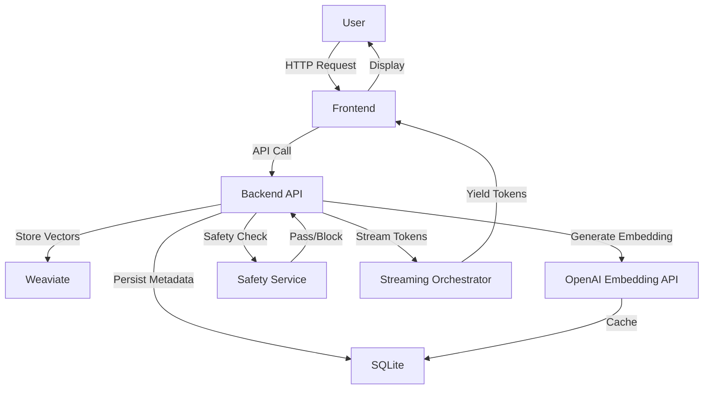

# Architecture Overview

This document provides a high‑level view of the RAG Knowledge Base Lab architecture, describing each major component, its responsibilities, and how they interact.

## System Components

| Component | Technology | Primary Role |
|-----------|------------|--------------|
| **Backend API** | FastAPI (Python) | Exposes HTTP endpoints for ingestion, query, collection management, and chat sessions |
| **SQLite** | SQLite (file‑based) | Stores relational metadata: collections, documents, chunks, ingestion attempts, embeddings cache, chat history, citations |
| **Weaviate** | Weaviate (Docker) | Hybrid vector + BM25 search index; stores chunk vectors and full text for fast semantic retrieval |
| **Embedding Service** | OpenAI API (text‑embedding‑3‑small) | Generates embeddings for chunk text; results cached in SQLite to avoid repeated calls |
| **Safety Service** | Custom Python filters | Performs prompt injection detection, content moderation, and grounding validation |
| **Streaming Orchestrator** | Async Python | Coordinates real‑time token streaming, safety checks, retrieval, and citation stitching |
| **Frontend** | Vite + React (TypeScript) | UI for document upload, chat interaction, and admin tools |
| **Docker** | Docker Compose (optional) | Runs Weaviate and any auxiliary services in isolated containers |

## Interaction Flow (Simplified)

## Data Flow for Ingestion
1. **Upload** – Frontend sends file/URL to `/ingestion/*` endpoint.
2. **Background Task** – Backend creates an `IngestionAttempt` row (SQLite) and queues a background worker.
3. **Chunking** – `ChunkingService` splits document into chunks, stores each in `chunks` table.
4. **Embedding** – For each chunk, `EmbeddingService` calls OpenAI, caches result in `embeddings`.
5. **Indexing** – Chunks and embeddings are sent to Weaviate, which stores them with metadata for hybrid search.
6. **Completion** – Status updated, citations ready for grounding.

## Data Flow for Query (Grounded Chat)
1. **Create Session** – Frontend POST `/chat/sessions` → `ChatRepository` creates `chat_sessions` row.
2. **User Turn** – POST `/chat/sessions/{id}/turns/stream` with query.
3. **Safety** – Query filtered through `SafetyService` (prompt‑injection, toxicity).
4. **Retrieval** – `AdvancedRetrievalService` queries Weaviate (hybrid) for relevant chunks.
5. **Grounding** – `GroundingService` verifies LLM answer against retrieved chunks, adds citations.
6. **Streaming** – `StreamingOrchestrator` streams tokens back to frontend while continually checking safety.
7. **Persist Turn** – Answer, citations, and safety status stored in SQLite.

---

## Where to Find Code
- API routers: `backend/routers/`
- Services: `backend/*/service.py`
- Repositories (SQLite access): `backend/repositories/`
- Retrieval & safety logic: `backend/grounding/`, `backend/safety/`
- Frontend components: `frontend/src/`

---

## Next‑Step Reading
- **Onboarding Guide** – [`docs/onboarding.md`](./onboarding.md)
- **API Flows** – [`docs/api-flows.md`](./api-flows.md)
- **AI Learning** – [`docs/ai-learning.md`](./ai-learning.md)
- **Database Schema** – [`docs/database-schema.md`](./database-schema.md)
- **System Flow Diagram** – [`docs/diagrams/system-flow.md`](./diagrams/system-flow.md)
