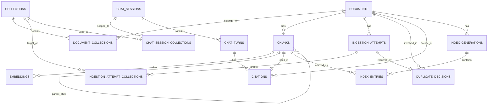

# Database Schema & Data Architecture

This document details the data models and storage strategies used in the RAG Knowledge Base Lab. The system employs a **Dual-Database Architecture** to combine the relational strengths of SQLite with the semantic search capabilities of ChromaDB.

---

## 1. High-Level Architecture

| Store | Technology | Purpose |
| :--- | :--- | :--- |
| **Metadata Store** | SQLite | Source of truth for all relational data, ingestion tracking, and grounding evidence. |
| **Vector Store** | ChromaDB | High-performance vector similarity search (ANN). |
| **Cache Layer** | SQLite | Stores pre-computed embeddings to minimize OpenAI API costs. |

---

## 2. Entity Relationship Diagram (ERD)

The following diagram illustrates the relationships between the primary entities in the SQLite database.

---

## 3. SQLite Table Definitions

### A. Knowledge Management

#### `collections`
Logical groupings for documents.
- `id` (TEXT, PK): UUID.
- `name` (TEXT, UNIQUE): Human-readable name.
- `description` (TEXT): Optional description.
- `is_default` (INTEGER): Flag for the system default collection.
- `routing_enabled` (INTEGER): Whether LLM-based routing is enabled for this collection.

#### `documents`
The parent record for uploaded files or URLs.
- `id` (TEXT, PK): UUID.
- `title` (TEXT): Descriptive title (Filename or Metadata).
- `source_type` (TEXT): pdf, txt, md, or url.
- `extracted_text` (TEXT): Full raw text content.
- `file_hash` (TEXT): SHA256 of the raw bytes.
- `normalized_text_hash` (TEXT): Hash of cleaned text for near-duplicate detection.
- `metadata_json` (TEXT): Extracted properties (page count, author, etc.).

#### `chunks`
Segmented units of a document.
- `id` (TEXT, PK): UUID.
- `document_id` (TEXT, FK): Reference to parent document.
- `text` (TEXT): The actual snippet.
- `chunk_order` (INTEGER): Position in the document.
- `strategy` (TEXT): fixed_size, semantic, or page_aware.
- `parent_chunk_id` (TEXT, FK): Recursive link for Parent-Child expansion.

---

### B. Ingestion & Duplicate Tracking

#### `ingestion_attempts`
Tracks the lifecycle of an upload or URL submission.
- `id` (TEXT, PK): UUID.
- `status` (TEXT): submitted, processing, completed, failed, awaiting_user_action.
- `duplicate_status` (TEXT): unique, exact_duplicate, near_duplicate, etc.
- `artifact_path` (TEXT): Path to the stored UUID-named file on disk.

#### `duplicate_decisions`
Records how a user resolved a collision.
- `action` (TEXT): skip, replace_existing, ingest_anyway, merge_metadata.
- `matched_document_id` (TEXT, FK): The existing document that triggered the conflict.

---

### C. Retrieval & Caching

#### `embeddings`
Caches vectors to save cost and latency.
- `id` (TEXT, PK): UUID.
- `chunk_id` (TEXT, FK): Reference to the chunk.
- `embedding_model` (TEXT): e.g., `text-embedding-3-small`.
- `embedding_vector` (BLOB): JSON-serialized list of floats.
- `input_text_hash` (TEXT): Used to validate cache freshness.

#### `index_entries`
Maps chunks to specific vector DB IDs across different indexing generations.
- `generation_id` (TEXT, FK): Links to `index_generations`.
- `is_active` (INTEGER): Determines if the entry is searchable in the current "live" index.

---

### D. Chat & Grounding

#### `chat_turns`
A single exchange in a session.
- `query_text` (TEXT): User's query.
- `answer_text` (TEXT): LLM's response.
- `groundedness_score` (REAL): Automated check against chunks.
- `safety_status` (TEXT): Trace of safety filter outcomes.

#### `citations`
Precise evidence linking.
- `turn_id` (TEXT, FK): Reference to the chat turn.
- `chunk_id` (TEXT, FK): The specific cited snippet.
- `quote_text` (TEXT): The exact quote used from the chunk.

---

## 4. Vector Store Schema (ChromaDB)

ChromaDB stores embeddings and minimal metadata for rapid similarity lookups.

| Property | Data Type | Purpose |
| :--- | :--- | :--- |
| **ID** | UUID | Maps 1:1 with SQLite `chunks.id`. |
| **Vector** | `float[1536]` | OpenAI Embedding. |
| **metadata.document_id** | String | For document-level filtering. |
| **metadata.collection_id**| String | For collection-scoped search. |
| **metadata.chunk_order** | Integer | Supports context expansion. |
| **metadata.page_number** | Integer | Used for rapid citation display. |
