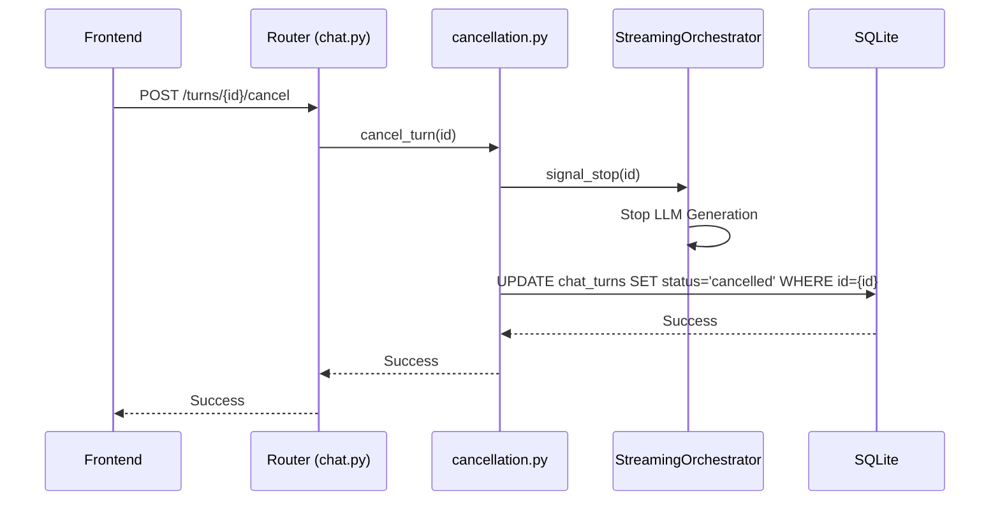

# API Flow: POST /turns/{id}/cancel

```mermaid
sequenceDiagram
    participant Frontend
    participant Router as Router (chat.py)
    participant cancellation.py
    participant StreamingOrchestrator
    participant SQLite
    
    Frontend->>Router: POST /turns/{id}/cancel
    Router->>cancellation.py: cancel_turn(id)
    cancellation.py->>StreamingOrchestrator: signal_stop(id)
    StreamingOrchestrator->>StreamingOrchestrator: Stop LLM Generation
    cancellation.py->>SQLite: UPDATE chat_turns SET status='cancelled' WHERE id={id}
    SQLite-->>cancellation.py: Success
    cancellation.py-->>Router: Success
    Router-->>Frontend: Success
```
