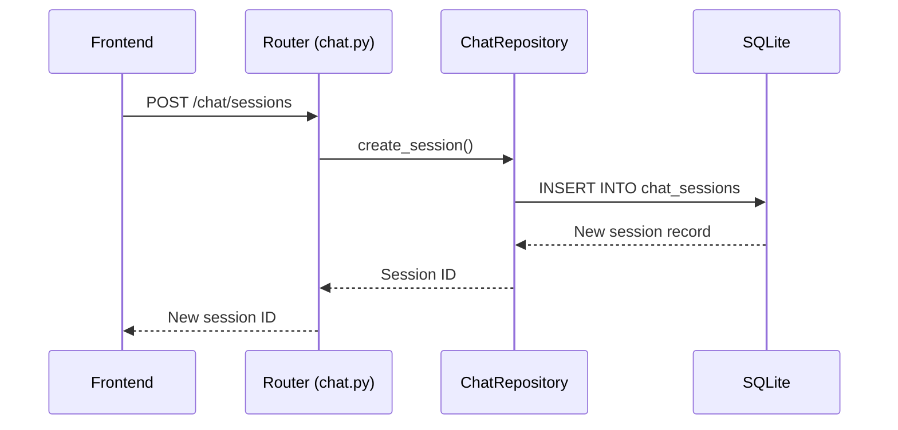

# API Flow: POST /chat/sessions

```mermaid
sequenceDiagram
    participant Frontend
    participant Router as Router (chat.py)
    participant ChatRepository
    participant SQLite
    
    Frontend->>Router: POST /chat/sessions
    Router->>ChatRepository: create_session()
    ChatRepository->>SQLite: INSERT INTO chat_sessions
    SQLite-->>ChatRepository: New session record
    ChatRepository-->>Router: Session ID
    Router-->>Frontend: New session ID
```
