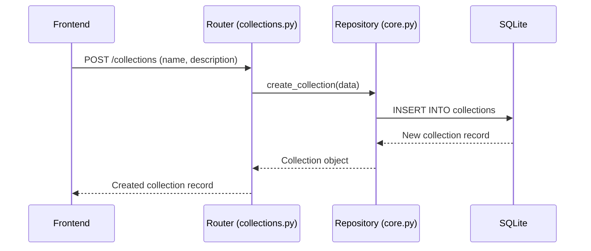

# API Flow: POST /collections

```mermaid
sequenceDiagram
    participant Frontend
    participant Router as Router (collections.py)
    participant Repository as Repository (core.py)
    participant SQLite
    
    Frontend->>Router: POST /collections (name, description)
    Router->>Repository: create_collection(data)
    Repository->>SQLite: INSERT INTO collections
    SQLite-->>Repository: New collection record
    Repository-->>Router: Collection object
    Router-->>Frontend: Created collection record
```
