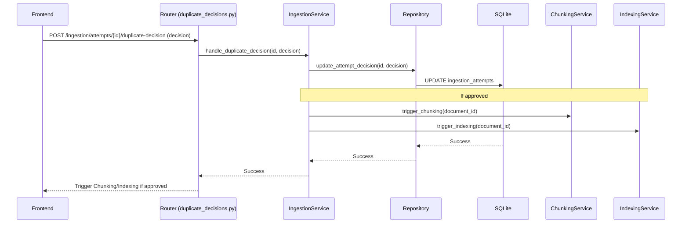

# API Flow: POST /ingestion/attempts/{id}/duplicate-decision

```mermaid
sequenceDiagram
    participant Frontend
    participant Router as Router (duplicate_decisions.py)
    participant IngestionService
    participant Repository
    participant SQLite
    participant ChunkingService
    participant IndexingService
    
    Frontend->>Router: POST /ingestion/attempts/{id}/duplicate-decision (decision)
    Router->>IngestionService: handle_duplicate_decision(id, decision)
    IngestionService->>Repository: update_attempt_decision(id, decision)
    Repository->>SQLite: UPDATE ingestion_attempts
    Note over IngestionService, IndexingService: If approved
    IngestionService->>ChunkingService: trigger_chunking(document_id)
    IngestionService->>IndexingService: trigger_indexing(document_id)
    SQLite-->>Repository: Success
    Repository-->>IngestionService: Success
    IngestionService-->>Router: Success
    Router-->>Frontend: Trigger Chunking/Indexing if approved
```
