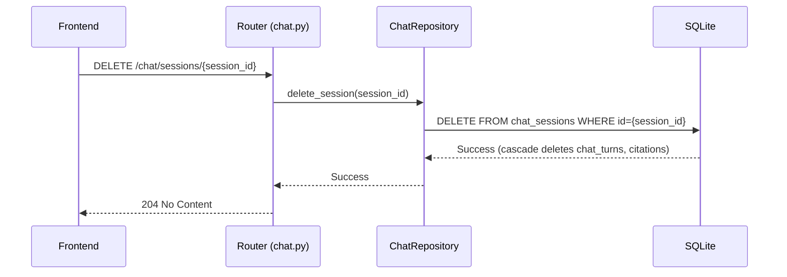

# API Flow: DELETE /chat/sessions/{session_id}

```mermaid
sequenceDiagram
    participant Frontend
    participant Router as Router (chat.py)
    participant ChatRepository
    participant SQLite
    
    Frontend->>Router: DELETE /chat/sessions/{session_id}
    Router->>ChatRepository: delete_session(session_id)
    ChatRepository->>SQLite: DELETE FROM chat_sessions WHERE id={session_id}
    SQLite-->>ChatRepository: Success (cascade deletes chat_turns, citations)
    ChatRepository-->>Router: Success
    Router-->>Frontend: 204 No Content
```
