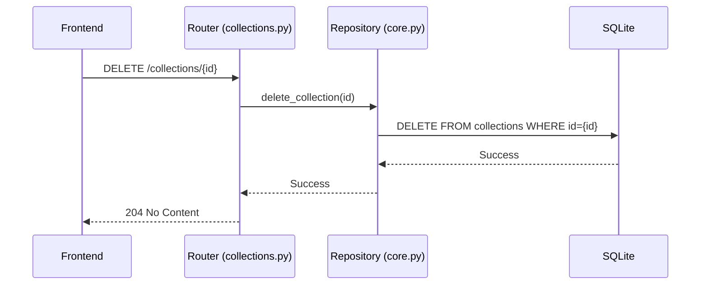

# API Flow: DELETE /collections/{id}

```mermaid
sequenceDiagram
    participant Frontend
    participant Router as Router (collections.py)
    participant Repository as Repository (core.py)
    participant SQLite
    
    Frontend->>Router: DELETE /collections/{id}
    Router->>Repository: delete_collection(id)
    Repository->>SQLite: DELETE FROM collections WHERE id={id}
    SQLite-->>Repository: Success
    Repository-->>Router: Success
    Router-->>Frontend: 204 No Content
```
