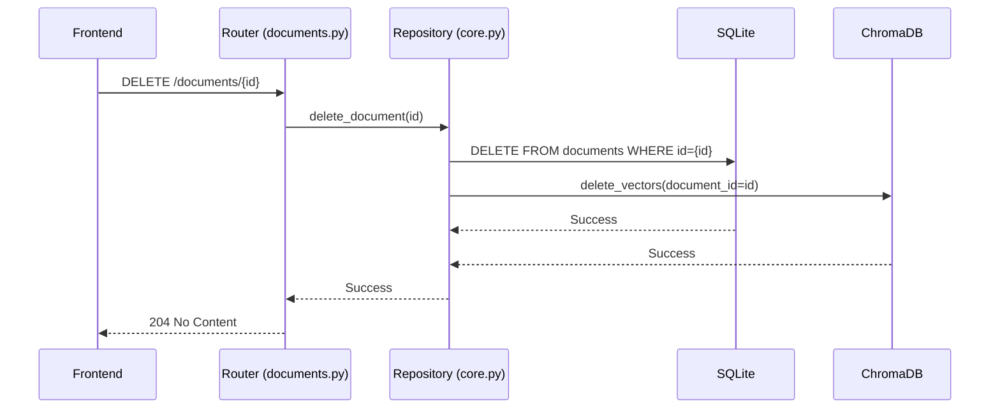

# API Flow: DELETE /documents/{id}

```mermaid
sequenceDiagram
    participant Frontend
    participant Router as Router (documents.py)
    participant Repository as Repository (core.py)
    participant SQLite
    participant ChromaDB
    
    Frontend->>Router: DELETE /documents/{id}
    Router->>Repository: delete_document(id)
    Repository->>SQLite: DELETE FROM documents WHERE id={id}
    Repository->>ChromaDB: delete_vectors(document_id=id)
    SQLite-->>Repository: Success
    ChromaDB-->>Repository: Success
    Repository-->>Router: Success
    Router-->>Frontend: 204 No Content
```
