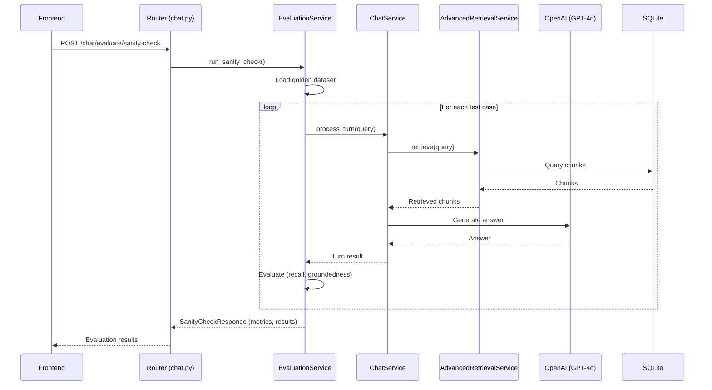

# API Flow: POST /chat/evaluate/sanity-check

```mermaid
sequenceDiagram
    participant Frontend
    participant Router as Router (chat.py)
    participant EvaluationService
    participant ChatService
    participant AdvancedRetrievalService
    participant OpenAI as OpenAI (GPT-4o)
    participant SQLite
    
    Frontend->>Router: POST /chat/evaluate/sanity-check
    Router->>EvaluationService: run_sanity_check()
    EvaluationService->>EvaluationService: Load golden dataset
    
    loop For each test case
        EvaluationService->>ChatService: process_turn(query)
        ChatService->>AdvancedRetrievalService: retrieve(query)
        AdvancedRetrievalService->>SQLite: Query chunks
        SQLite-->>AdvancedRetrievalService: Chunks
        AdvancedRetrievalService-->>ChatService: Retrieved chunks
        ChatService->>OpenAI: Generate answer
        OpenAI-->>ChatService: Answer
        ChatService-->>EvaluationService: Turn result
        EvaluationService->>EvaluationService: Evaluate (recall, groundedness)
    end
    
    EvaluationService-->>Router: SanityCheckResponse (metrics, results)
    Router-->>Frontend: Evaluation results
```
