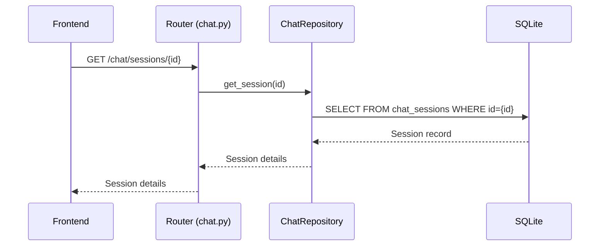

# API Flow: GET /chat/sessions/{id}

```mermaid
sequenceDiagram
    participant Frontend
    participant Router as Router (chat.py)
    participant ChatRepository
    participant SQLite
    
    Frontend->>Router: GET /chat/sessions/{id}
    Router->>ChatRepository: get_session(id)
    ChatRepository->>SQLite: SELECT FROM chat_sessions WHERE id={id}
    SQLite-->>ChatRepository: Session record
    ChatRepository-->>Router: Session details
    Router-->>Frontend: Session details
```
