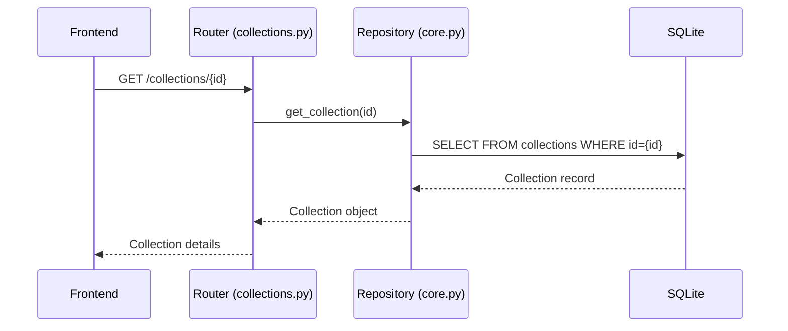

# API Flow: GET /collections/{id}

```mermaid
sequenceDiagram
    participant Frontend
    participant Router as Router (collections.py)
    participant Repository as Repository (core.py)
    participant SQLite
    
    Frontend->>Router: GET /collections/{id}
    Router->>Repository: get_collection(id)
    Repository->>SQLite: SELECT FROM collections WHERE id={id}
    SQLite-->>Repository: Collection record
    Repository-->>Router: Collection object
    Router-->>Frontend: Collection details
```
