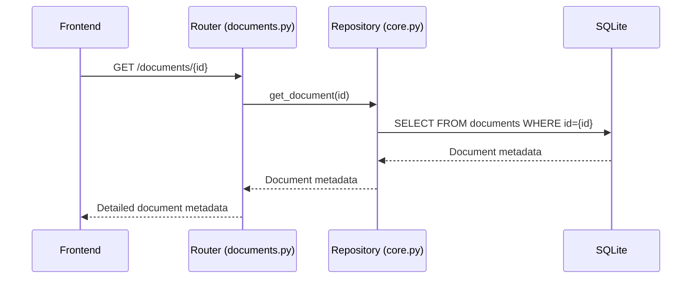

# API Flow: GET /documents/{id}

```mermaid
sequenceDiagram
    participant Frontend
    participant Router as Router (documents.py)
    participant Repository as Repository (core.py)
    participant SQLite
    
    Frontend->>Router: GET /documents/{id}
    Router->>Repository: get_document(id)
    Repository->>SQLite: SELECT FROM documents WHERE id={id}
    SQLite-->>Repository: Document metadata
    Repository-->>Router: Document metadata
    Router-->>Frontend: Detailed document metadata
```
