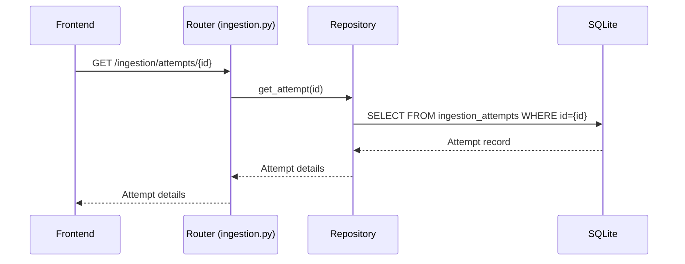

# API Flow: GET /ingestion/attempts/{id}

```mermaid
sequenceDiagram
    participant Frontend
    participant Router as Router (ingestion.py)
    participant Repository
    participant SQLite
    
    Frontend->>Router: GET /ingestion/attempts/{id}
    Router->>Repository: get_attempt(id)
    Repository->>SQLite: SELECT FROM ingestion_attempts WHERE id={id}
    SQLite-->>Repository: Attempt record
    Repository-->>Router: Attempt details
    Router-->>Frontend: Attempt details
```
