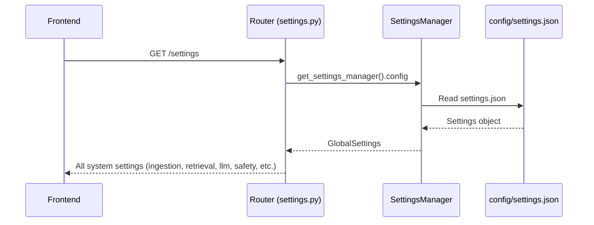

# API Flow: GET /settings

```mermaid
sequenceDiagram
    participant Frontend
    participant Router as Router (settings.py)
    participant SettingsManager
    participant ConfigFile as config/settings.json
    
    Frontend->>Router: GET /settings
    Router->>SettingsManager: get_settings_manager().config
    SettingsManager->>ConfigFile: Read settings.json
    ConfigFile-->>SettingsManager: Settings object
    SettingsManager-->>Router: GlobalSettings
    Router-->>Frontend: All system settings (ingestion, retrieval, llm, safety, etc.)
```
