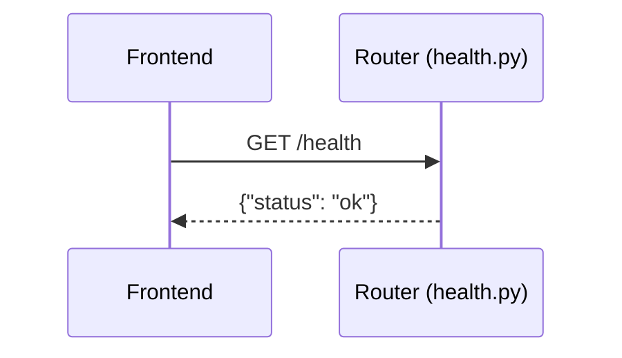

# API Flow: GET /health

```mermaid
sequenceDiagram
    participant Frontend
    participant Router as Router (health.py)
    
    Frontend->>Router: GET /health
    Router-->>Frontend: {"status": "ok"}
```
