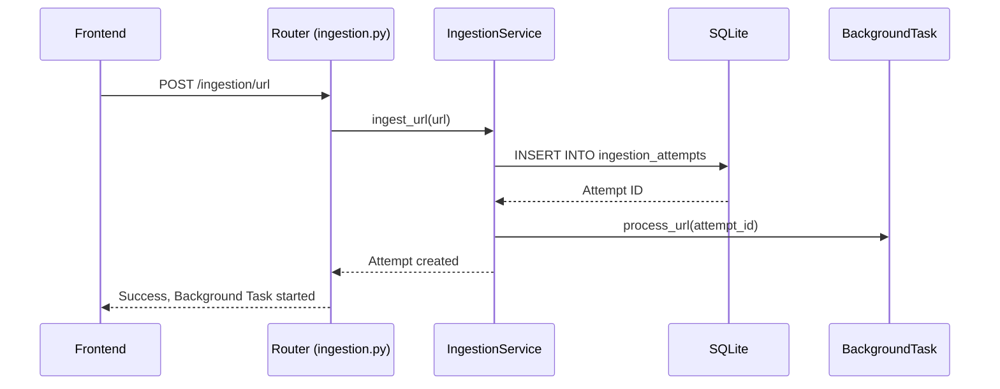

# API Flow: POST /ingestion/url

```mermaid
sequenceDiagram
    participant Frontend
    participant Router as Router (ingestion.py)
    participant IngestionService
    participant SQLite
    participant BackgroundTask
    
    Frontend->>Router: POST /ingestion/url
    Router->>IngestionService: ingest_url(url)
    IngestionService->>SQLite: INSERT INTO ingestion_attempts
    SQLite-->>IngestionService: Attempt ID
    IngestionService->>BackgroundTask: process_url(attempt_id)
    IngestionService-->>Router: Attempt created
    Router-->>Frontend: Success, Background Task started
```
