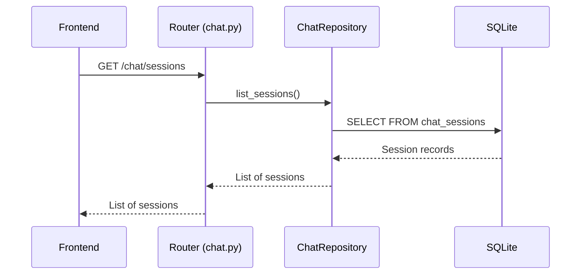

# API Flow: GET /chat/sessions

```mermaid
sequenceDiagram
    participant Frontend
    participant Router as Router (chat.py)
    participant ChatRepository
    participant SQLite
    
    Frontend->>Router: GET /chat/sessions
    Router->>ChatRepository: list_sessions()
    ChatRepository->>SQLite: SELECT FROM chat_sessions
    SQLite-->>ChatRepository: Session records
    ChatRepository-->>Router: List of sessions
    Router-->>Frontend: List of sessions
```
