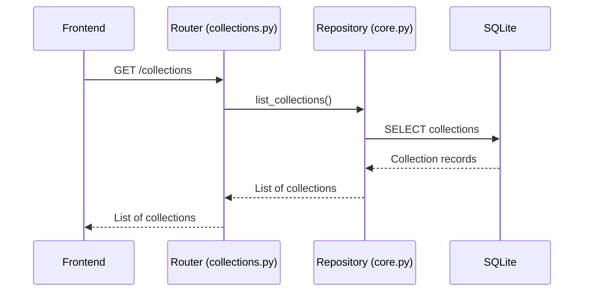

# API Flow: GET /collections

```mermaid
sequenceDiagram
    participant Frontend
    participant Router as Router (collections.py)
    participant Repository as Repository (core.py)
    participant SQLite
    
    Frontend->>Router: GET /collections
    Router->>Repository: list_collections()
    Repository->>SQLite: SELECT collections
    SQLite-->>Repository: Collection records
    Repository-->>Router: List of collections
    Router-->>Frontend: List of collections
```
