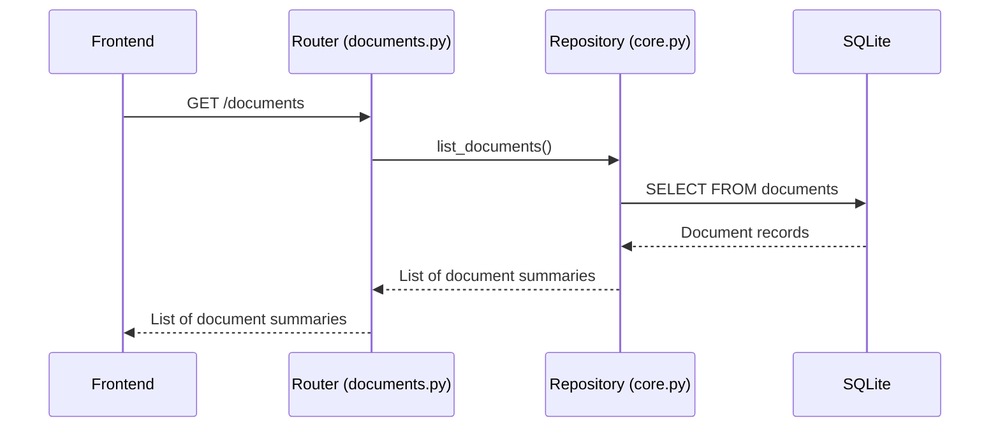

# API Flow: GET /documents

```mermaid
sequenceDiagram
    participant Frontend
    participant Router as Router (documents.py)
    participant Repository as Repository (core.py)
    participant SQLite
    
    Frontend->>Router: GET /documents
    Router->>Repository: list_documents()
    Repository->>SQLite: SELECT FROM documents
    SQLite-->>Repository: Document records
    Repository-->>Router: List of document summaries
    Router-->>Frontend: List of document summaries
```
