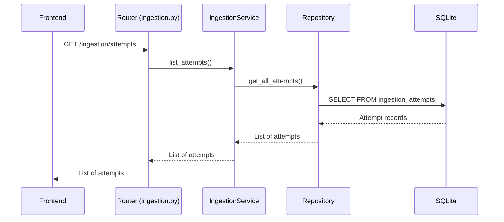

# API Flow: GET /ingestion/attempts

```mermaid
sequenceDiagram
    participant Frontend
    participant Router as Router (ingestion.py)
    participant IngestionService
    participant Repository
    participant SQLite
    
    Frontend->>Router: GET /ingestion/attempts
    Router->>IngestionService: list_attempts()
    IngestionService->>Repository: get_all_attempts()
    Repository->>SQLite: SELECT FROM ingestion_attempts
    SQLite-->>Repository: Attempt records
    Repository-->>IngestionService: List of attempts
    IngestionService-->>Router: List of attempts
    Router-->>Frontend: List of attempts
```
