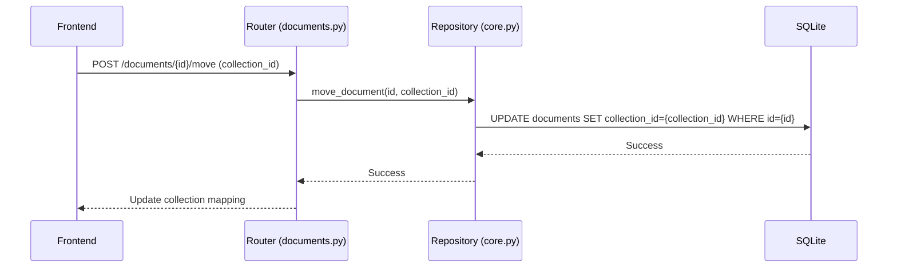

# API Flow: POST /documents/{id}/move

```mermaid
sequenceDiagram
    participant Frontend
    participant Router as Router (documents.py)
    participant Repository as Repository (core.py)
    participant SQLite
    
    Frontend->>Router: POST /documents/{id}/move (collection_id)
    Router->>Repository: move_document(id, collection_id)
    Repository->>SQLite: UPDATE documents SET collection_id={collection_id} WHERE id={id}
    SQLite-->>Repository: Success
    Repository-->>Router: Success
    Router-->>Frontend: Update collection mapping
```
