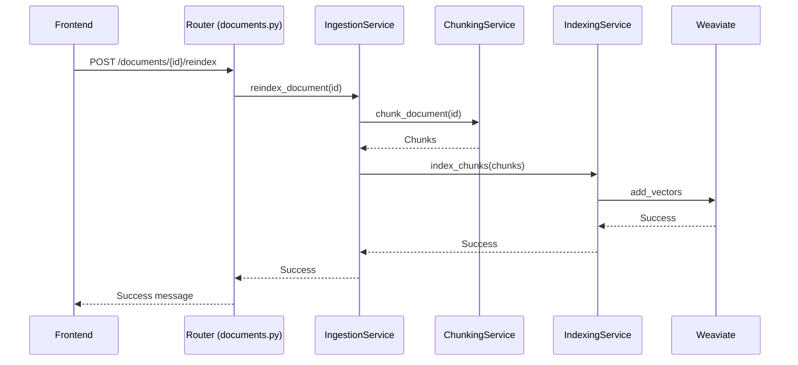

# API Flow: POST /documents/{id}/reindex

```mermaid
sequenceDiagram
    participant Frontend
    participant Router as Router (documents.py)
    participant IngestionService
    participant ChunkingService
    participant IndexingService
    participant Weaviate
    
    Frontend->>Router: POST /documents/{id}/reindex
    Router->>IngestionService: reindex_document(id)
    IngestionService->>ChunkingService: chunk_document(id)
    ChunkingService-->>IngestionService: Chunks
    IngestionService->>IndexingService: index_chunks(chunks)
    IndexingService->>Weaviate: add_vectors
    Weaviate-->>IndexingService: Success
    IndexingService-->>IngestionService: Success
    IngestionService-->>Router: Success
    Router-->>Frontend: Success message
```
