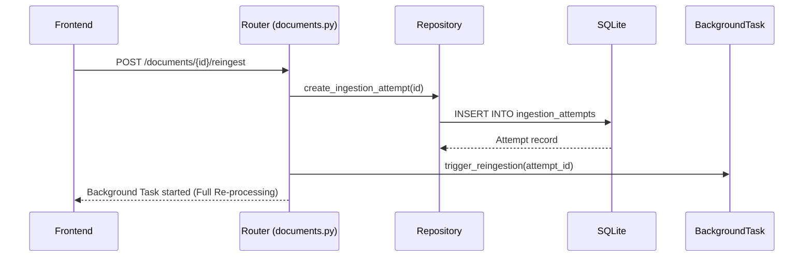

# API Flow: POST /documents/{id}/reingest

```mermaid
sequenceDiagram
    participant Frontend
    participant Router as Router (documents.py)
    participant Repository
    participant SQLite
    participant BackgroundTask
    
    Frontend->>Router: POST /documents/{id}/reingest
    Router->>Repository: create_ingestion_attempt(id)
    Repository->>SQLite: INSERT INTO ingestion_attempts
    SQLite-->>Repository: Attempt record
    Router->>BackgroundTask: trigger_reingestion(attempt_id)
    Router-->>Frontend: Background Task started (Full Re-processing)
```
