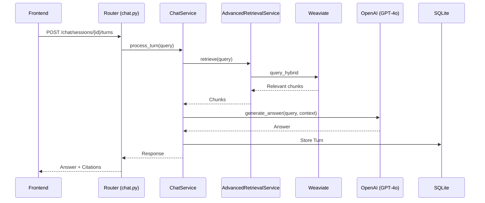

# API Flow: POST /chat/sessions/{id}/turns

```mermaid
sequenceDiagram
    participant Frontend
    participant Router as Router (chat.py)
    participant ChatService
    participant AdvancedRetrievalService
    participant Weaviate
    participant OpenAI as OpenAI (GPT-4o)
    participant DB as SQLite
    
    Frontend->>Router: POST /chat/sessions/{id}/turns
    Router->>ChatService: process_turn(query)
    
    ChatService->>AdvancedRetrievalService: retrieve(query)
    AdvancedRetrievalService->>Weaviate: query_hybrid
    Weaviate-->>AdvancedRetrievalService: Relevant chunks
    AdvancedRetrievalService-->>ChatService: Chunks
    
    ChatService->>OpenAI: generate_answer(query, context)
    OpenAI-->>ChatService: Answer
    
    ChatService->>DB: Store Turn
    ChatService-->>Router: Response
    Router-->>Frontend: Answer + Citations
```
