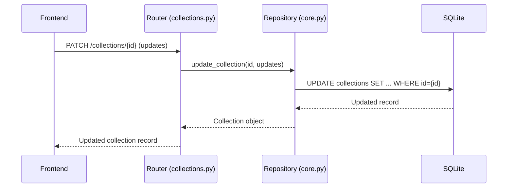

# API Flow: PATCH /collections/{id}

```mermaid
sequenceDiagram
    participant Frontend
    participant Router as Router (collections.py)
    participant Repository as Repository (core.py)
    participant SQLite
    
    Frontend->>Router: PATCH /collections/{id} (updates)
    Router->>Repository: update_collection(id, updates)
    Repository->>SQLite: UPDATE collections SET ... WHERE id={id}
    SQLite-->>Repository: Updated record
    Repository-->>Router: Collection object
    Router-->>Frontend: Updated collection record
```
