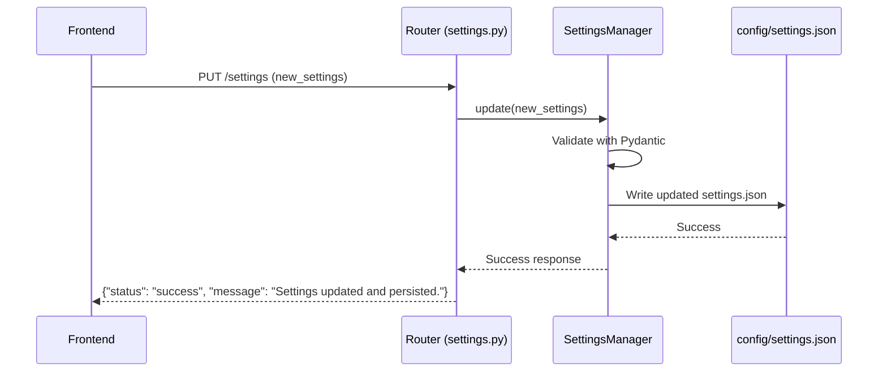

# API Flow: PUT /settings

```mermaid
sequenceDiagram
    participant Frontend
    participant Router as Router (settings.py)
    participant SettingsManager
    participant ConfigFile as config/settings.json
    
    Frontend->>Router: PUT /settings (new_settings)
    Router->>SettingsManager: update(new_settings)
    SettingsManager->>SettingsManager: Validate with Pydantic
    SettingsManager->>ConfigFile: Write updated settings.json
    ConfigFile-->>SettingsManager: Success
    SettingsManager-->>Router: Success response
    Router-->>Frontend: {"status": "success", "message": "Settings updated and persisted."}
```
