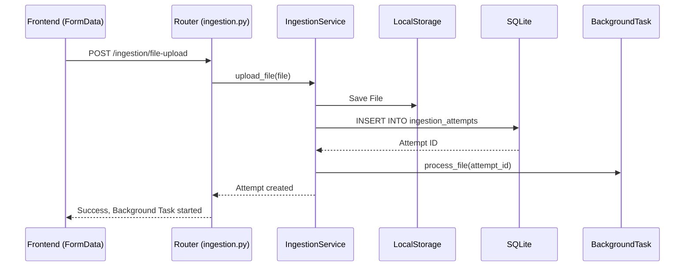

# API Flow: POST /ingestion/file-upload

```mermaid
sequenceDiagram
    participant Frontend (FormData)
    participant Router as Router (ingestion.py)
    participant IngestionService
    participant LocalStorage
    participant SQLite
    participant BackgroundTask
    
    Frontend (FormData)->>Router: POST /ingestion/file-upload
    Router->>IngestionService: upload_file(file)
    IngestionService->>LocalStorage: Save File
    IngestionService->>SQLite: INSERT INTO ingestion_attempts
    SQLite-->>IngestionService: Attempt ID
    IngestionService->>BackgroundTask: process_file(attempt_id)
    IngestionService-->>Router: Attempt created
    Router-->>Frontend (FormData): Success, Background Task started
```
