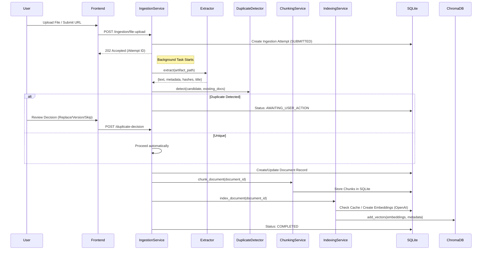
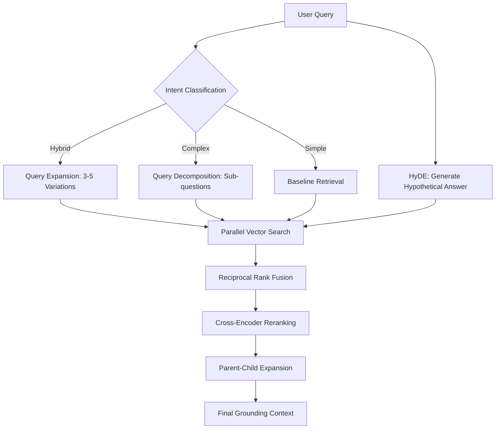
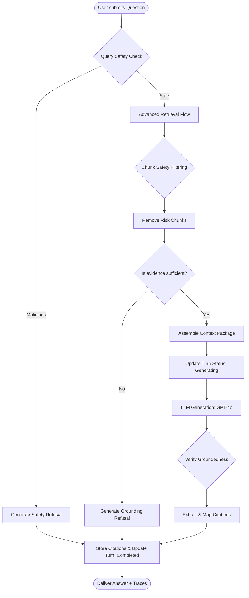
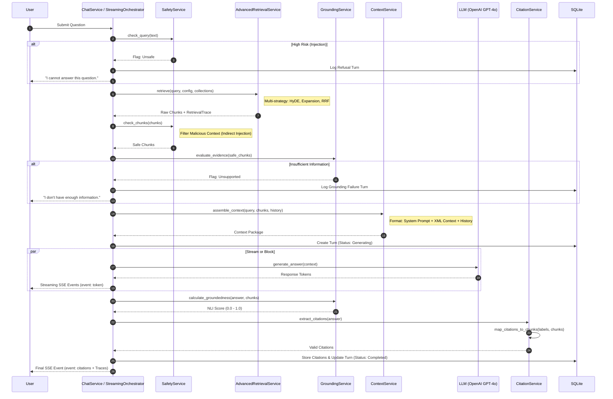

# Comprehensive System End-to-End Flow

This document provides a detailed map of all workflows within the RAG Knowledge Base Lab, covering Knowledge Ingestion, Management, Advanced Retrieval, and Grounded Chat.

---

## 1. System Architecture & Data Storage

The system utilizes a dual-storage strategy to balance complex metadata management with high-performance vector search.

### A. Metadata & Cache Store (SQLite)
**Location:** `backend/data/knowledge_base.db` (configured via `DATABASE_PATH`)

SQLite is the primary source of truth for all relational data and serves as a high-speed cache for expensive LLM operations.

| Table | Details & Data Stored |
| :--- | :--- |
| **Collections** | Logical namespaces; Stores `name`, `description`, `is_default`, and `routing_enabled`. |
| **Documents** | File/URL metadata; Stores `title`, `source_type`, `file_hash`, `normalized_text_hash`, and the full `extracted_text`. |
| **Chunks** | Atomic text units; Stores the `text` snippet, `chunk_order`, `strategy` used, and hierarchical links (`parent_chunk_id`). |
| **Embeddings** | **Cache Layer**; Stores the raw `embedding_vector` as a JSON array and an `input_text_hash`. This allows the system to skip OpenAI API calls if the text has not changed. |
| **Index Entries** | The "Glue"; Maps `chunk_id` to `embedding_id` and `vector_db_id` for consistent retrieval across re-indexing generations. |
| **Chat Sessions** | Stores session state and the selected `collection_ids` scope. |
| **Chat Turns** | Full query history; Stores `query_text`, `answer_text`, `groundedness_score`, and `safety_trace`. |
| **Citations** | Grounding evidence; Links specific chat turns to chunks with `quote_text` and metadata. |

### B. Vector Store (ChromaDB)
**Location:** `data/.chroma_db` (configured via `CHROMA_PERSIST_DIR`)

ChromaDB is optimized for Approximate Nearest Neighbor (ANN) search. It stores minimal data to remain fast and lightweight.

- **Vectors:** 1536-dimensional embeddings (OpenAI `text-embedding-3-small`).
- **Metadata (in Chroma):** 
    - `chunk_id`: UUID for joining with SQLite.
    - `document_id`: For document-level filtering.
    - `collection_id`: For rapid collection-scoped search.
    - `chunk_order`: To support neighbor lookups and parent-child expansion.
    - `page_number` / `section_title`: For rapid citation display before SQLite join.

---

## 2. Core Workflows

### A. Knowledge Ingestion & Duplicate Handling
Transforms raw data into indexed chunks with collision detection.

---

### B. Advanced Retrieval Flow
Intelligent query processing to maximize recall and precision.

1.  **Intent Classification:** LLM determines if the query is simple, complex (multi-step), or requires specific collection routing.
2.  **Query Expansion:** Generates 3-5 variations of the query to overcome semantic gaps.
3.  **HyDE (Hypothetical Document Embeddings):** Generates a synthetic answer to use as a "perfect" query vector.
4.  **Parallel Vector Search:** Executes all expanded queries against ChromaDB in parallel.
5.  **RRF (Reciprocal Rank Fusion):** Merges results from multiple retrieval strategies into a single ranked list.
6.  **Cross-Encoder Reranking:** A secondary LLM pass to re-score the top 20 candidates for maximum relevance.
7.  **Parent-Child Expansion:** Retrieves small chunks (e.g., 200 tokens) for precision but expands them to "parent" chunks (e.g., 1000 tokens) before sending to the LLM to provide broader context.

---

### C. Grounded Question-to-Answer Logical Workflow
The decision logic and processing steps for generating a safe, grounded response.

---

### D. Grounded Question-to-Answer Sequence
Detailed interaction between components during the chat lifecycle.

---

### E. Grounding & Citation Logic details

1.  **Citation Mapping:** The LLM is instructed to use `[n]` markers corresponding to the context chunks provided in the prompt.
2.  **Verification:** `CitationService` verifies that every `[n]` used in the answer actually exists in the retrieved set.
3.  **Traceability:** The system returns a "Retrieval Trace" (which chunks were found and why) and a "Safety Trace" (which safety filters were triggered).
4.  **Grounding Check:** 
    - **Pre-check:** `GroundingService` performs a rapid evaluation of the retrieved chunks against the query intent.
    - **Post-check:** `GroundingService` calculates a final groundedness score (0.0-1.0) using NLI (Natural Language Inference) logic between the generated answer and the source chunks.
