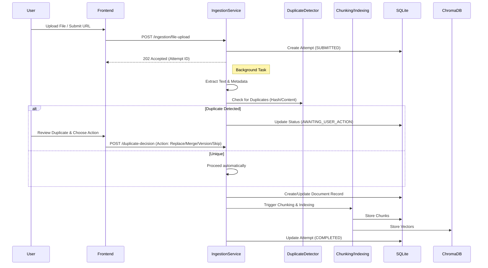
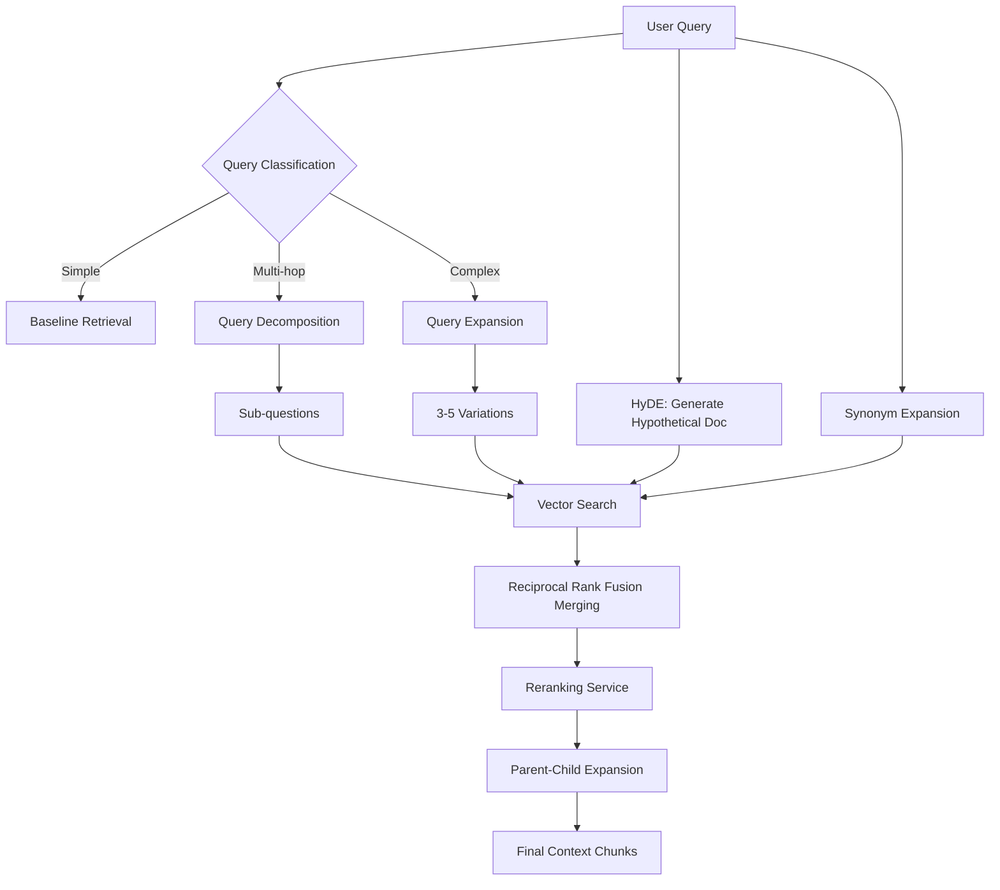

# Comprehensive System End-to-End Flow

This document provides a detailed map of all workflows within the RAG Knowledge Base Lab, covering Knowledge Ingestion, Management, Advanced Retrieval, and Grounded Chat.

---

## 1. System Architecture Overview

- **Frontend:** React (Vite) SPA.
- **Backend:** FastAPI with specialized service layers.
- **Metadata Store:** SQLite (Relational data, Ingestion attempts, Citations).
- **Vector Store:** ChromaDB (Embeddings, Semantic search).
- **LLM Provider:** OpenAI (GPT-4o for generation and query intelligence, Text-Embedding-3-Small for indexing).

---

## 2. Core Workflows

### A. Knowledge Ingestion & Duplicate Handling
This flow handles the lifecycle of transforming raw data into searchable knowledge.

**Duplicate Actions:**
- **Skip:** Do not ingest.
- **Ingest Anyway:** Create a new independent document.
- **Replace Existing:** Overwrite metadata/text of the matched document.
- **Merge Metadata:** Keep existing text but combine metadata fields.
- **Ingest as New Version:** Link the new document as a version of the old one.

---

### B. Knowledge Management (Collections & Documents)
Workflows for organizing and maintaining the knowledge base.

1.  **Collection Management:**
    - **CRUD:** Users can Create, List, Update, and Delete collections.
    - **Scoping:** Documents are assigned to one or more collections.
2.  **Document Operations:**
    - **Move:** Re-assign a document to different collections.
    - **Delete:** Remove document metadata, chunks, and vectors.
    - **Re-index:** Re-run chunking and embedding (useful if strategy/model changes).
    - **Re-ingest:** Full extraction-to-indexing cycle for an existing document.

---

### C. Advanced Retrieval Intelligence
Before searching, the system applies several LLM-powered transformations to improve recall and precision.

**Key Strategies:**
- **Auto-Collection Detection:** LLM identifies which collection is most relevant to the query.
- **HyDE:** Generates a "fake" answer and uses its embedding to find similar real documents.
- **RRF:** Merges results from multiple queries (original + expanded + sub-questions) into a single ranked list.
- **Parent-Child Expansion:** Retrieves small chunks for precision but provides larger "parent" chunks to the LLM for better context.

---

### D. Grounded Chat (RAG) Flow
The final step where retrieved knowledge is synthesized into an answer.

1.  **Retrieval:** Executes the Advanced Retrieval flow (Section C).
2.  **Grounding Evaluation:** `GroundingService` checks if the retrieved chunks are sufficient. If not, the system returns a polite refusal rather than hallucinating.
3.  **Context Assembly:** Combines query, history, and retrieved chunks into a specialized prompt.
4.  **Generation (Streaming):** LLM generates the answer with citations (e.g., `[1]`).
5.  **Citation Validation:** `CitationService` ensures every `[n]` in the text correctly maps to a retrieved chunk.
6.  **Traceability:** The system returns a "Retrieval Trace" showing exactly which strategies were used and how long they took.

---

## 3. Component Directory Map

| Feature Area | Backend Path | Frontend Path |
| :--- | :--- | :--- |
| **Ingestion** | `backend/ingestion/` | `screens/KnowledgeBase.jsx` |
| **Extraction** | `backend/extractors/` | N/A |
| **Duplicates** | `backend/duplicate_detection/` | `components/DuplicateDecisionModal.jsx` |
| **Chunking** | `backend/chunking/` | N/A |
| **Indexing** | `backend/indexing/` | N/A |
| **Chat Service** | `backend/chat/` | `screens/Chat.jsx` |
| **Retrieval** | `backend/chat/retrieval.py` | `components/AdvancedConfigPanel.jsx` |
| **Metadata** | `backend/repositories/` | N/A |
| **Vector DB** | `.chroma_db/` | N/A |
