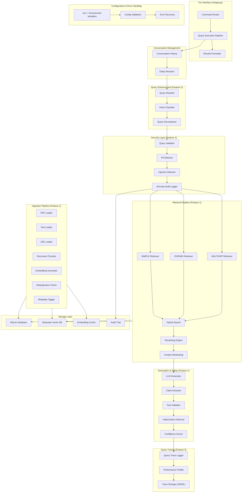
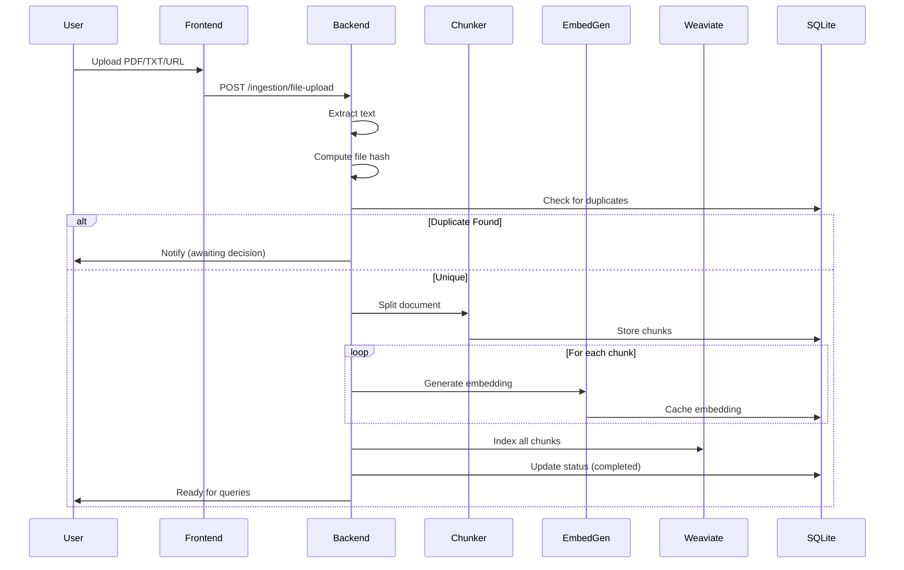
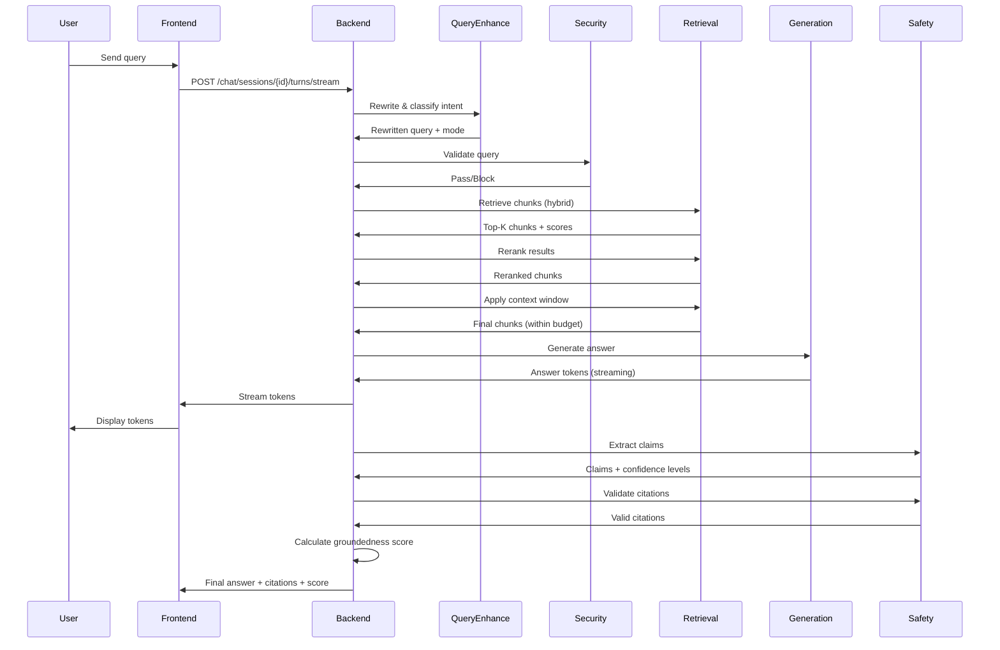

# System Architecture - Comprehensive Overview

This document provides a detailed view of the RAG Knowledge Base Lab architecture, describing all major components, their responsibilities, interactions, and the complete feature matrix.

---

## 1. System Components

| Component | Technology | Primary Role | Status |
|-----------|------------|--------------|--------|
| **Backend API** | FastAPI (Python) | Exposes HTTP endpoints for ingestion, query, collection management, and chat sessions | ✅ Active |
| **SQLite** | SQLite (file-based) | Stores relational metadata: collections, documents, chunks, ingestion attempts, embeddings cache, chat history, citations | ✅ Active |
| **Weaviate** | Weaviate (Docker) | Hybrid vector + BM25 search index; stores chunk vectors and full text for fast semantic retrieval | ✅ Active |
| **Embedding Service** | OpenAI API (text-embedding-3-small) | Generates embeddings for chunk text; results cached in SQLite to avoid repeated calls | ✅ Active |
| **Safety Service** | Custom Python filters | Performs prompt injection detection, content moderation, PII detection, and grounding validation | ✅ Active |
| **Streaming Orchestrator** | Async Python | Coordinates real-time token streaming, safety checks, retrieval, and citation stitching | ✅ Active |
| **Query Enhancement** | Python (retrieval module) | Query rewriting, intent classification, query decomposition, and mode selection | ✅ Active |
| **Retrieval Service** | Python (retrieval module) | Multi-strategy retrieval: SIMPLE, EXPAND, MULTIHOP, AUTO modes with hybrid search | ✅ Active |
| **Reranking Engine** | Rule-based + ML | Refines retrieved results using term overlap, position bias, and structural signals | ✅ Active |
| **Entity Resolver** | Python (conversation module) | Resolves pronouns and references in multi-turn conversations | ✅ Active |
| **Claim Extractor** | Python (safety module) | Extracts individual claims from answers with confidence level classification | ✅ Active |
| **Frontend** | Vite + React (TypeScript) | UI for document upload, chat interaction, collection management, and admin tools | ✅ Active |
| **Docker Compose** | Docker | Orchestrates Weaviate and auxiliary services in isolated containers | ✅ Active |

---

## 2. Complete System Architecture Diagram

---

## 3. Feature Matrix - Complete Implementation Status

| Category | Feature | Components | Status |
|----------|---------|------------|--------|
| **Core RAG** | PDF/Text/URL loading | PDFLoader, TextLoader, URLLoader | ✅ Complete |
| | Document chunking | Chunker (fixed-size, semantic, page-aware) | ✅ Complete |
| | Embedding generation | EmbedGen + OpenAI API | ✅ Complete |
| | Embedding caching | EmbedCache (SQLite) | ✅ Complete |
| | Hybrid search | HybridSearch (BM25 + semantic) | ✅ Complete |
| **Query Enhancement** | Query rewriting | Rewriter (LLM-based) | ✅ Complete |
| | Intent classification | IntentClass (LLM + heuristic) | ✅ Complete |
| | Query decomposition | Decomposer (multi-part queries) | ✅ Complete |
| | Mode auto-selection | AUTO mode (SIMPLE/EXPAND/MULTIHOP) | ✅ Complete |
| **Retrieval Strategies** | SIMPLE mode | SimpleRet (fast, focused) | ✅ Complete |
| | EXPAND mode | ExpandRet (multi-query) | ✅ Complete |
| | MULTIHOP mode | MultiHopRet (chained reasoning) | ✅ Complete |
| | Reranking | Reranker (rule-based + ML) | ✅ Complete |
| | Context windowing | ContextWindow (token budget) | ✅ Complete |
| **Collection Management** | Metadata tagging | MetadataTag (key-value pairs) | ✅ Complete |
| | Filtering | HybridSearch filters | ✅ Complete |
| | Deduplication | DedupCheck (similarity-based) | ✅ Complete |
| | Backup/restore | SQLite dump/restore | ✅ Complete |
| | Reindexing | Weaviate re-index | ✅ Complete |
| **Input Validation & Security** | Query injection detection | InjectionDetect (40+ patterns) | ✅ Complete |
| | PII scanning | PIIDetect (email, phone, SSN, card) | ✅ Complete |
| | PII suppression | Redaction before ingestion | ✅ Complete |
| | Security audit trail | AuditLog (JSONL format) | ✅ Complete |
| **Generation & Safety** | LLM generation | LLMGen (Ollama/OpenAI) | ✅ Complete |
| | Claim extraction | ClaimExt (HIGH/MEDIUM/LOW confidence) | ✅ Complete |
| | Fact validation | FactVal (token overlap check) | ✅ Complete |
| | Hallucination detection | HallDet (unsupported claims) | ✅ Complete |
| | Confidence scoring | ConfScore (0.0-1.0 metric) | ✅ Complete |
| **Conversation** | Multi-turn support | History (conversation tracking) | ✅ Complete |
| | Entity resolution | EntityRes (pronoun replacement) | ✅ Complete |
| | Context awareness | History + EntityRes | ✅ Complete |
| **Query Tracing & Observability** | End-to-end tracing | QueryTrace (all steps logged) | ✅ Complete |
| | Performance profiling | PerfProf (latency, throughput) | ✅ Complete |
| | JSON Lines persistence | TraceStore (.jsonl format) | ✅ Complete |
| | Trace display | CLI --trace flag | ✅ Complete |
| **CLI & UX** | Command interface | Router + Executor | ✅ Complete |
| | Help system | Built-in documentation | ✅ Complete |
| | Collection management | Commands for CRUD ops | ✅ Complete |
| | Results formatting | Formatter (user-friendly output) | ✅ Complete |

---

## 4. Data Flow for Ingestion

---

## 5. Data Flow for Query (Grounded Chat)

---

## 6. Component Responsibilities

### Query Enhancement Pipeline
- **Query Rewriter**: Clarifies ambiguous queries using LLM
- **Intent Classifier**: Determines query complexity (SIMPLE/EXPAND/MULTIHOP)
- **Query Decomposer**: Breaks multi-part queries into sub-queries
- **Mode Selector**: Chooses optimal retrieval strategy

### Retrieval Pipeline
- **SIMPLE Retriever**: Fast semantic search for straightforward queries
- **EXPAND Retriever**: Multi-query generation for multi-aspect questions
- **MULTIHOP Retriever**: Chained reasoning for causal questions
- **Hybrid Search**: Combines BM25 (keyword) + semantic (vector) scoring
- **Reranker**: Refines ordering using term overlap, position, structure
- **Context Window**: Selects highest-scoring chunks within token budget

### Safety & Validation
- **Query Validator**: Detects injection patterns (SQL, NoSQL, XSS, command)
- **PII Detector**: Identifies sensitive data (email, phone, SSN, card)
- **Claim Extractor**: Parses claims with confidence levels
- **Fact Validator**: Verifies claims against source chunks
- **Hallucination Detector**: Flags unsupported statements
- **Confidence Scorer**: Calculates answer trustworthiness (0.0-1.0)

### Conversation Management
- **Conversation History**: Maintains multi-turn context
- **Entity Resolver**: Resolves pronouns to prior entities
- **Context Awareness**: Combines history + entity resolution

### Observability
- **Query Tracer**: Logs all execution steps
- **Performance Profiler**: Measures latency, throughput, cost
- **Trace Logger**: Persists traces to JSONL for analysis

---

## 7. Technology Stack

| Layer | Technology | Purpose |
|-------|-----------|---------|
| **Frontend** | Vite + React + TypeScript | User interface |
| **Backend API** | FastAPI (Python) | REST API endpoints |
| **Metadata Store** | SQLite | Relational data + embedding cache |
| **Vector Store** | Weaviate (Docker) | Hybrid search index |
| **Embedding Model** | OpenAI text-embedding-3-small | Semantic vectors (1536-dim) |
| **LLM** | OpenAI GPT-4o or Ollama | Answer generation |
| **Async Runtime** | Python asyncio | Concurrent operations |
| **Configuration** | .env + environment variables | Settings management |
| **Logging** | JSONL format | Audit trail + traces |

---

## 8. Where to Find Code

| Component | Location |
|-----------|----------|
| API routers | `backend/routers/` |
| Services | `backend/*/service.py` |
| Repositories (SQLite) | `backend/repositories/` |
| Query enhancement | `backend/query_enhancement/` |
| Retrieval strategies | `backend/retrieval/` |
| Safety & validation | `backend/safety/` |
| Conversation | `backend/conversation/` |
| Grounding & citations | `backend/grounding/` |
| Frontend components | `frontend/src/` |
| Configuration | `backend/config/` |
| Error handling | `backend/errors/` |

---

## 9. Cross-References

- **Onboarding Guide** – [`docs/onboarding.md`](./onboarding.md)
- **API Flows** – [`docs/api-flows.md`](./api-flows.md)
- **AI Learning Guide** – [`docs/ai-learning.md`](./ai-learning.md)
- **Database Schema** – [`docs/database-schema.md`](./database-schema.md)
- **System Flow Diagrams** – [`docs/diagrams/system-flow.md`](./diagrams/system-flow.md)
- **Enhancement Recommendations** – [`docs/enhancement-recommendations.md`](./enhancement-recommendations.md)

---

## 10. Next Steps

For implementation roadmap and enhancement recommendations, see [`docs/enhancement-recommendations.md`](./enhancement-recommendations.md).
